# TestFlight Auto Deployment Setup 

CI/CD is the combination of continuous integration (CI) and continuous delivery (CD). A CI/CD pipeline automates the process of software delivery. It builds code, runs tests, and helps you to safely deploy a new version of the software. In addition, a CI/CD pipeline reduces manual errors, provides feedback to developers, and allows fast product iterations.

## GitHub Actions

GitHub Actions is a CI/CD tool for a GitHub-based development workflow. You can use it to integrate and deploy code changes to an application or a platform as well as to test, track, and manage code changes.

Create and integrate a workflow using GitHub Actions:

* A workflow can be triggered from a pull request or a push to a specific/any branch.
* A workflow must have at least one job.
* A job contains a set of steps that perform individual tasks and steps that can run commands or use an action.

You can configure your workflows to run when specific activity on GitHub happens, at a scheduled time, or when an event outside of GitHub occurs.

Here are some [events that trigger workflows](https://docs.github.com/en/actions/using-workflows/events-that-trigger-workflows).

## Continuous Integration

In order to automate the testing process, if missing, you need to create the directory .github/workflows/ in the root of the repository to store the workflows. Then you create a YAML file to configure the workflow.

The first step is to check out the repository.

The second step is to specify which Xcode version you want the code to be built with and the steps to execute, one script each, to test the iOS app.

Steps to specify Xcode version:

Open the cloned MagicBox's repository in Finder: you will able to see the project files.

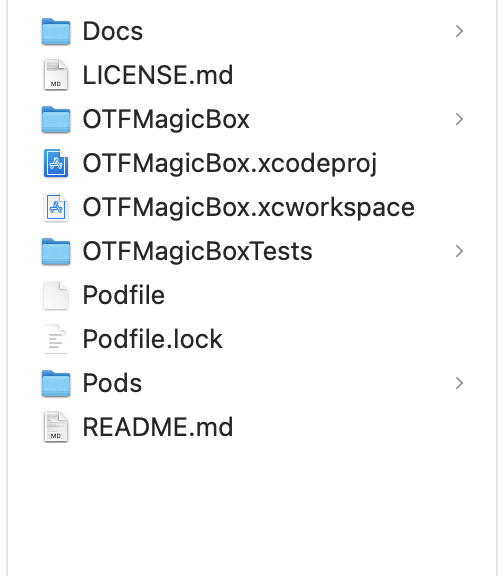

Use the keyboard shortcut *“Command” + “Shift” + “.” * to see the hidden files in the MagicBox directory.

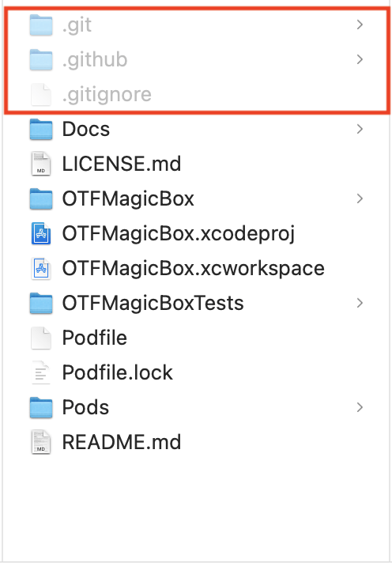

Navigate to *.github/workflows/Testing.yml* file.

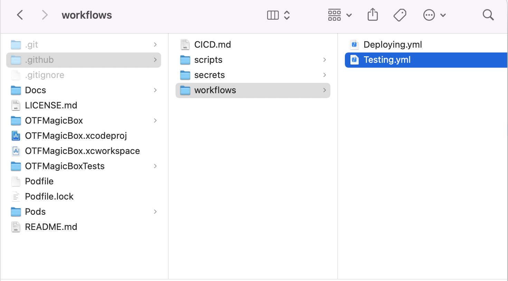

Open the *Testing.yml* file and specify the Xcode version.

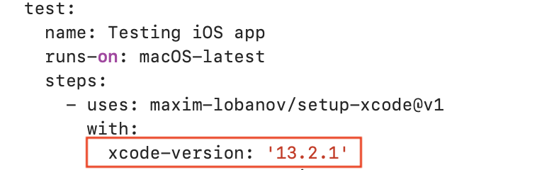

## Export Certificates From Keychain

Open *Keychain Access* and find the installed certificate, expand the certificate and select both certificate and private key.

On right click a dialog box opens: select the export option as shown below.

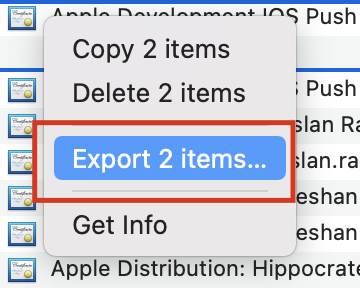

Then a dialog box opens: enter an appropriate certificate name, select the .p12 format and press *Save*.
 
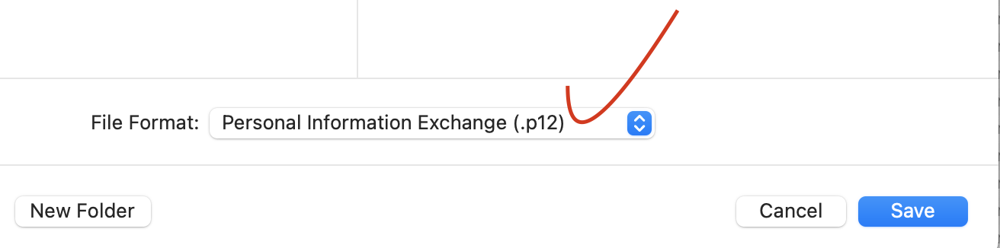

Finally, enter and confirm the password required by the certificate, then press *Okay*.

You can follow the steps above to create development and distribution certificates.

### App Store Connect

Navigate to the App Store Connect in the side bar.

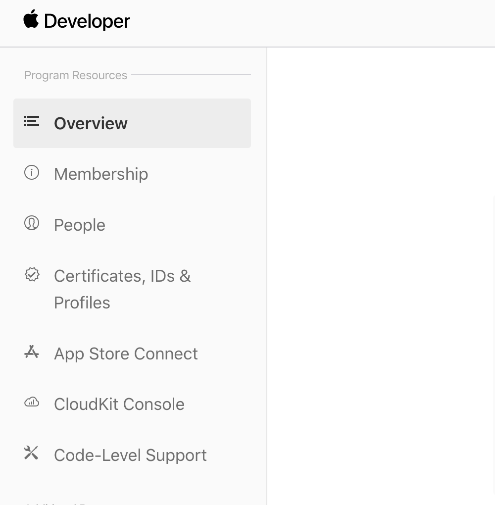

You can also navigate to App Store Connect using this link [App Store Connect](https://appstoreconnect.apple.com/).

Select My Apps.

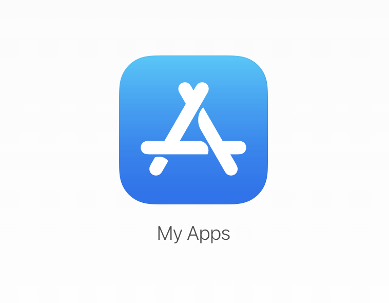

Create a new application using the plus button.

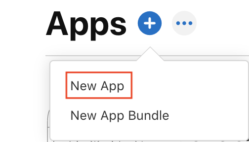

Fill in the information, in the dropdown menu select the bundle identifier that you registered in your Apple developer account and create the application.

You will not able to see the application on *TestFlight* if you choose the wrong bundle identifier.

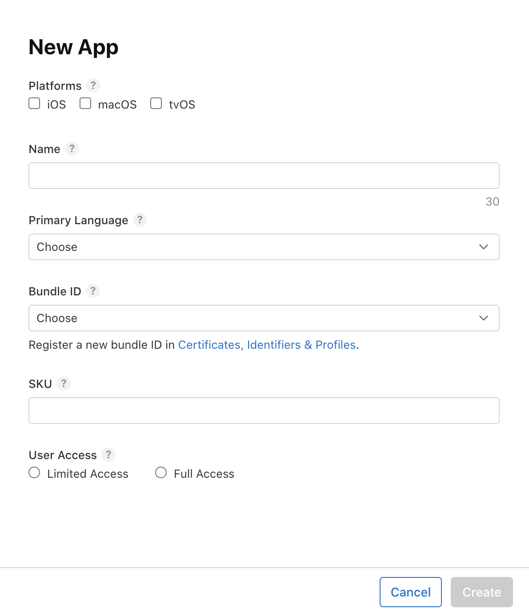

## GitHub Secrets

Secrets are encrypted environment variables that you create in an organization, repository, or repository environment. The secrets that you create are available to use in GitHub Actions workflows.

To add each secret to your GitHub repository, you will first need to navigate to the repository’s *Settings* tab.

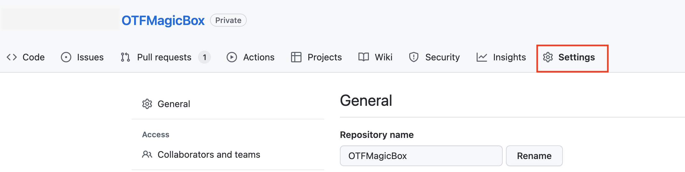

Then select *Actions* from the sidebar.

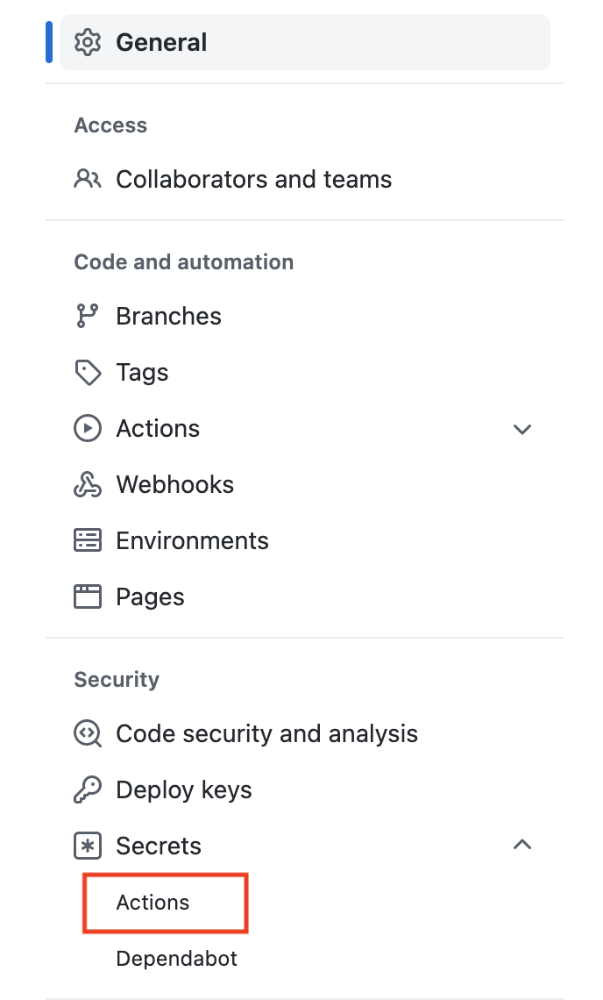

To add one secret, click the *New repository secret* button.

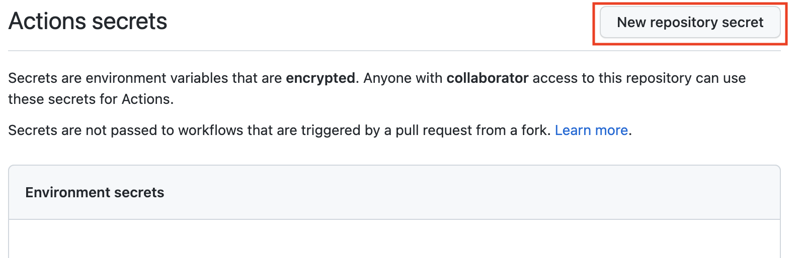

Then enter the name of the secret and the value. Finally, click *Add secret*.

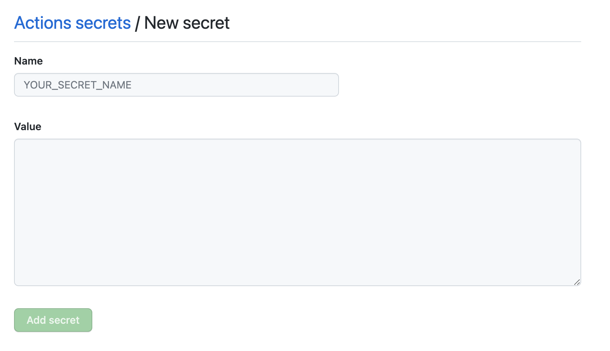

These are the secrets you need to store in GitHub in order for the workflow to run successfully:

* The signing certificate data
* Signing certificate password
* The provisioning profile data
* The App Store Connect username
* The App Store Connect password

## Continuous Deployment

In order to deploy an iOS app to [TestFlight](https://developer.apple.com/testflight/) you need to complete the following steps:

* Create a distribution certificate and a provisioning profile for distribution to the App Store.
* Create an app-specific password.
* Export the certificate with the .p12 format
* Use encrypted certificate data
* Create secrets in your repository

You need encrypted certificate data to save in your GitHub secrets, which are listed below:

### SIGNING_CERTIFICATE_P12_DATA_RELEASE

To generate the encrypted certificate data, you will export the certificate identity from the *Keychain Access* application. Export the .p12 files and save them.
Next, open a *Terminal* window and find the p12 file on your computer. Run the following command using the path and filename of that file (dragging and dropping a file into Terminal automatically generates the correct file path):

`cat YourCertificate.p12 | base64 | pbcopy`

Paste the copied text as the value of the SIGNING_CERTIFICATE_P12_DATA parameter in the GitHub secret.

### SIGNING_CERTIFICATES_PASSWORD

This parameter is the password that is used while exporting the signing certificates from your Keychain Access. Make sure you save the correct password in this secret otherwise you will get the `security: SecKeychainItemImport: MAC verification failed during PKCS12 import (wrong password?)` error.

### PROVISIONING_PROFILE_DATA_RELEASE

You need to base64-encode the provisioning profile that you created and downloaded during the project setup and then copy it to your clipboard. Run the following command, replacing the `profile.mobileprovision` filename with the name of the provisioning profile you downloaded.

`cat YourProfile.mobileprovision | base64 | pbcopy`

Paste the copied text as the value of the PROVISIONING_PROFILE_DATA parameter in the secret.

### APP_STORE_CONNECT_USERNAME

This secret should be set to the Apple ID of your developer account.

### APP_STORE_CONNECT_PASSWORD

This secret should be set to an application-specific password for your Apple ID account.

