# Registration on Apple Developer Portal

The following shows how to set up an app in your Apple developer account.

## Register Bundle identifier

Sign in to your Apple developer account.

Then navigate to *Certificates, Identifiers & Profiles* from the side menu.

Register an *application bundle identifier* by navigating to *Identifiers*.

Click on the *plus button* to create a new identifier, as shown in the figure below.

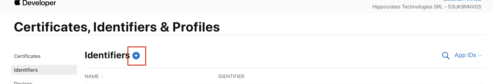

Select the *App IDs* option to register an identifier and press continue.

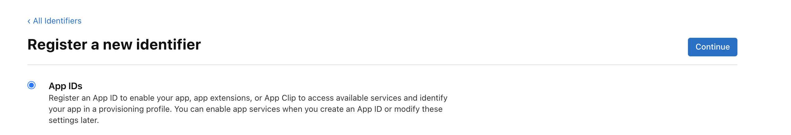

Then select *App* and press continue.

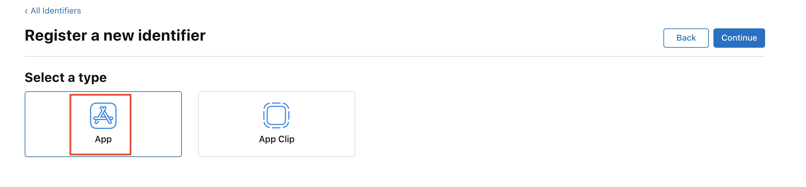

Specify a *Description* and a *Bundle ID* specific to your organization. Then press continue.

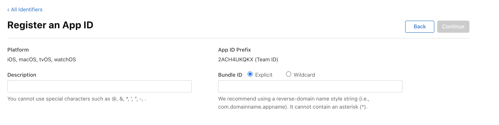

Register an identifier other than "org.theraforge.magicbox.ios" (which is already taken) otherwise you will get an error.

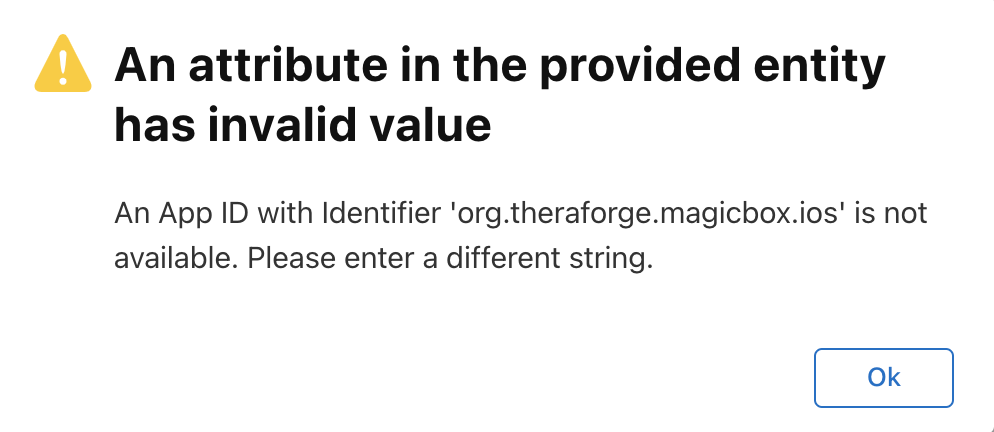

## Create Certificates & Profiles on your Apple Developer Account

To create a signing certificate for development and one for release, navigate to *Certificates* and click the *plus* button to create a new certificate.

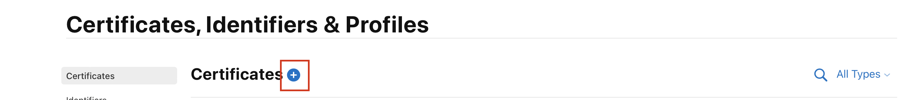

To create a software development certificate, click on *Apple Development* and press continue.

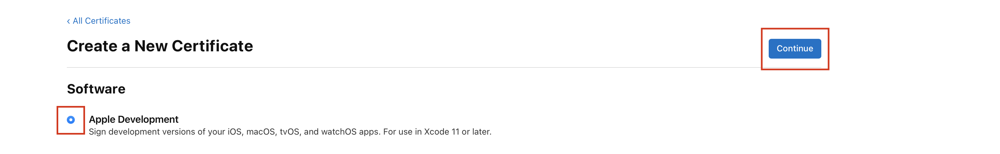

Then, on the next window, to generate a certificate you need a *Certificate Signing Request (CSR)* file from your computer. Select the *Choose File* option, as shown below, to upload a CSR that you have created.

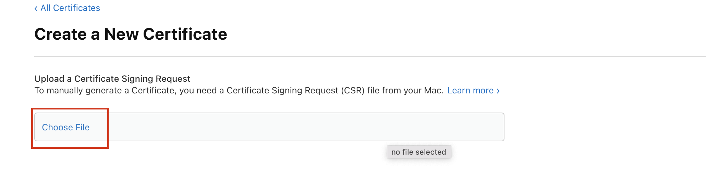

To create a Certificate Signing Request (CSR) file open the *Keychain Access* application on your Mac (you can quickly find it using the Spotlight search function).

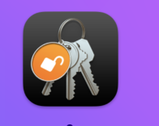

Navigate to *Keychain Access* --> *Certificate Assistant* --> *Request a Certificate From a Certificate Authority*.

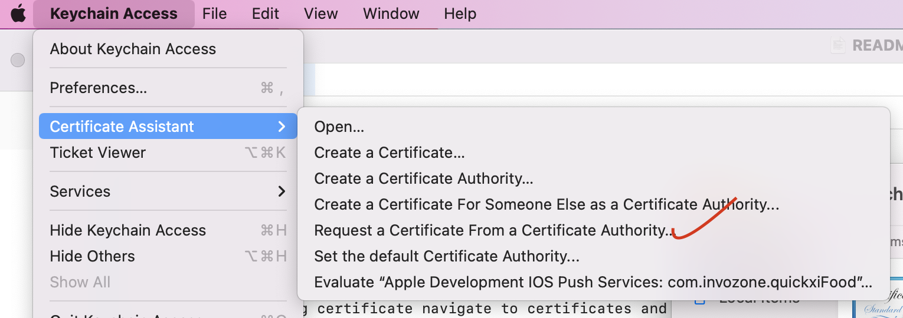

A dialog box opens to enter the CSR info: enter your email address and select the option *Saved to disk*.

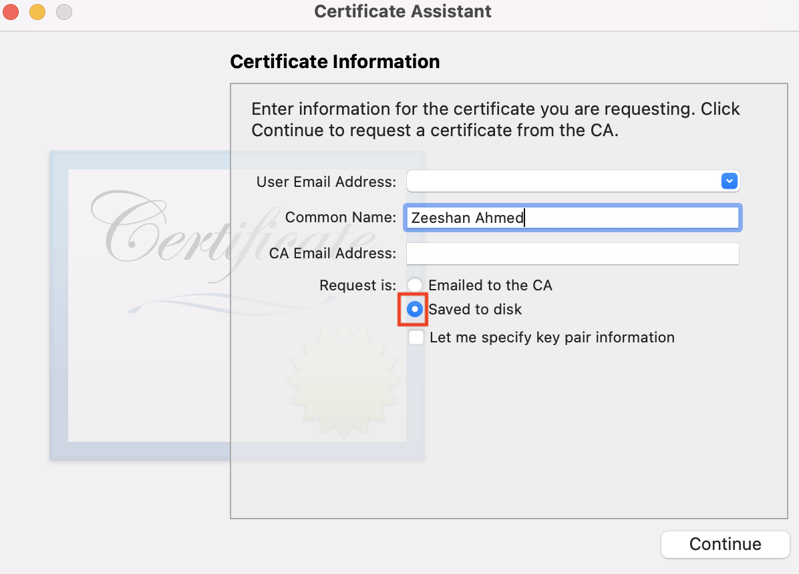

Find the saved CSR file, upload it (as shown above) to create a certificate, press continue and download the certificate.

Find and double click the downloaded certificate to install it in your keychain.

Navigate to the profiles section to create profile for development and one for release.

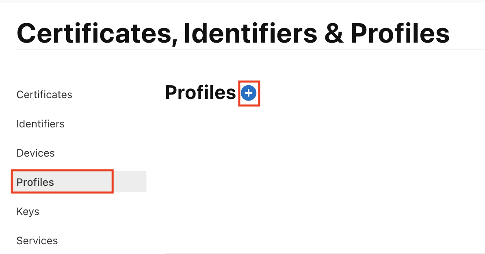

Click on the *plus* button and select the profile for development and press continue.

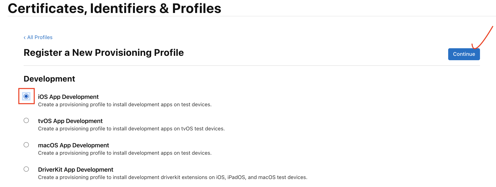

Next select the identifier from the drop down menu with which you want to create a provisioning profile, then press continue.

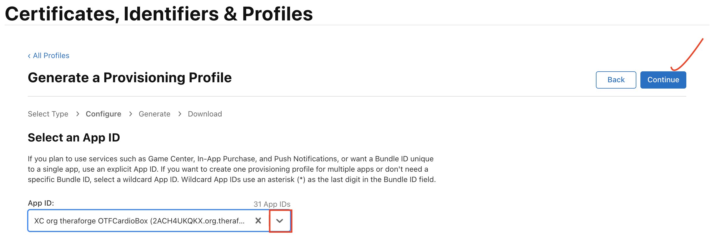

You will find the certificate that you previously created, select the certificate and press continue.

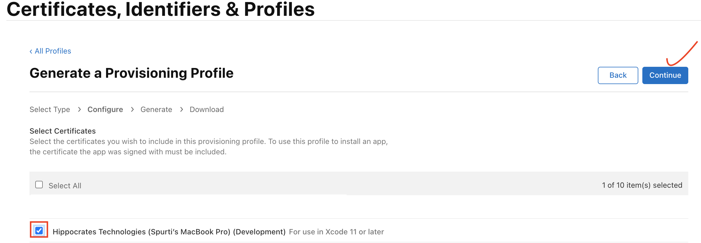

If you have registered the device on *Apple Developer Account* a list of registered iPhone will appear, select the device on which you want to install the app with this profile and press continue.

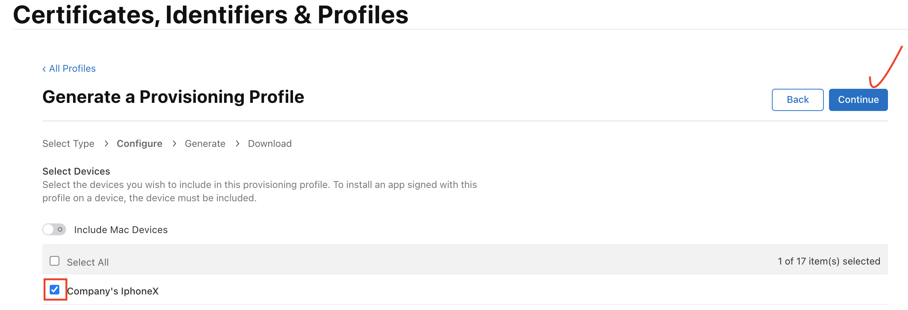

Add provisioning profile name and press continue.

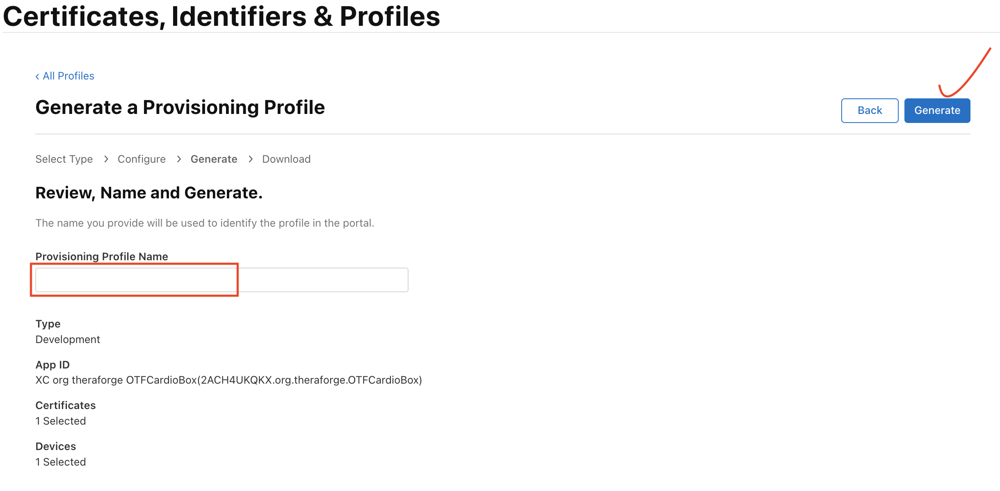

Finally download the profile.

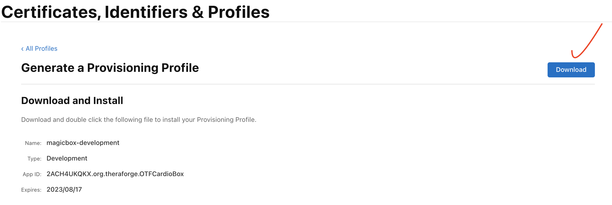

Find and double click the downloaded profile to install it in Xcode.
