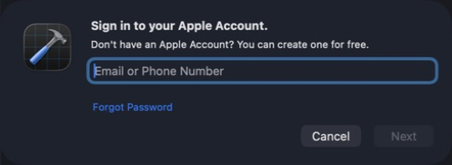
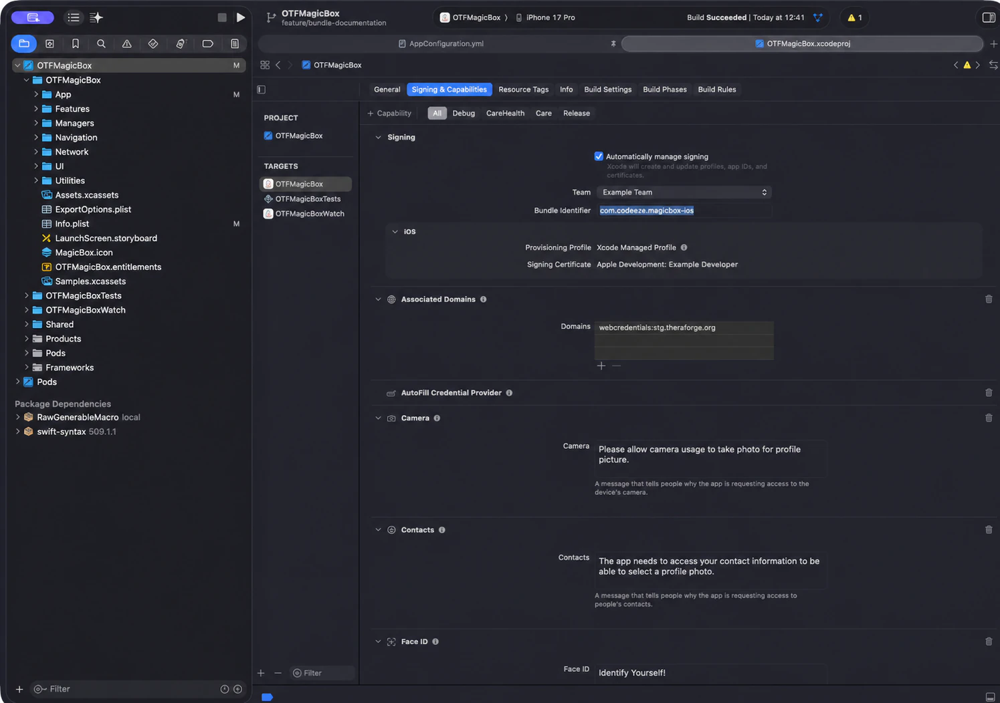
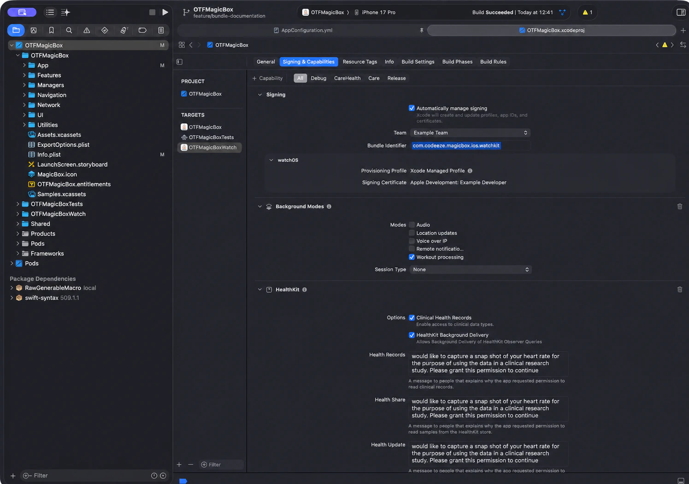
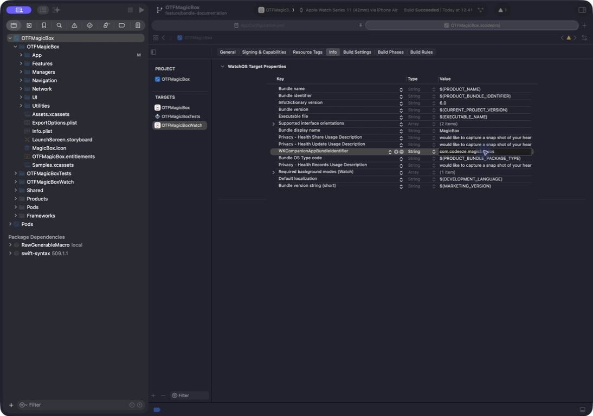
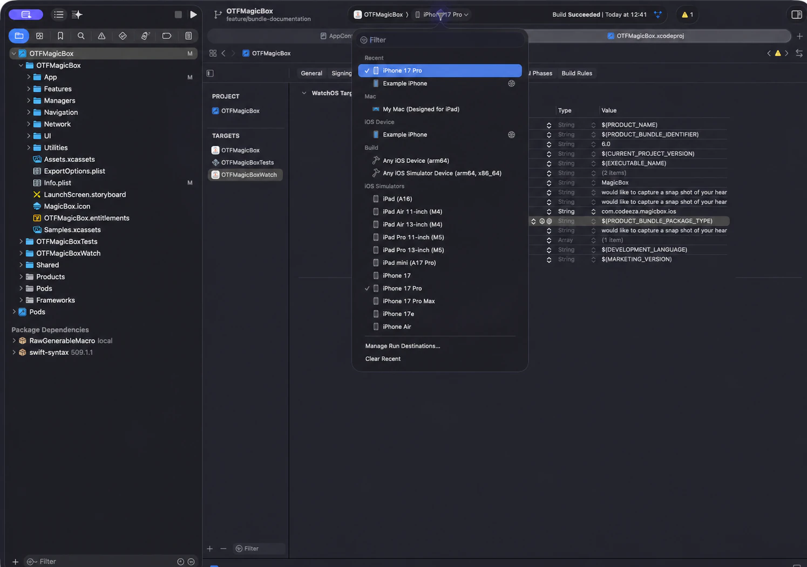
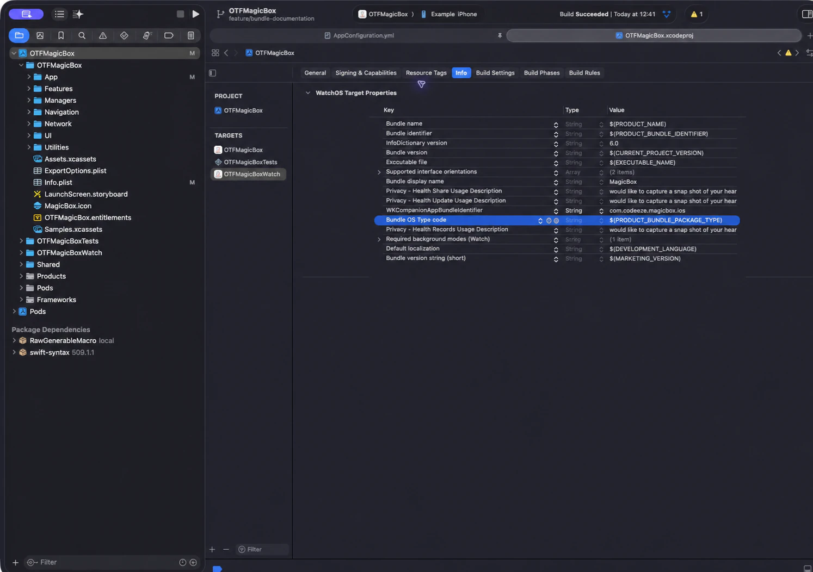
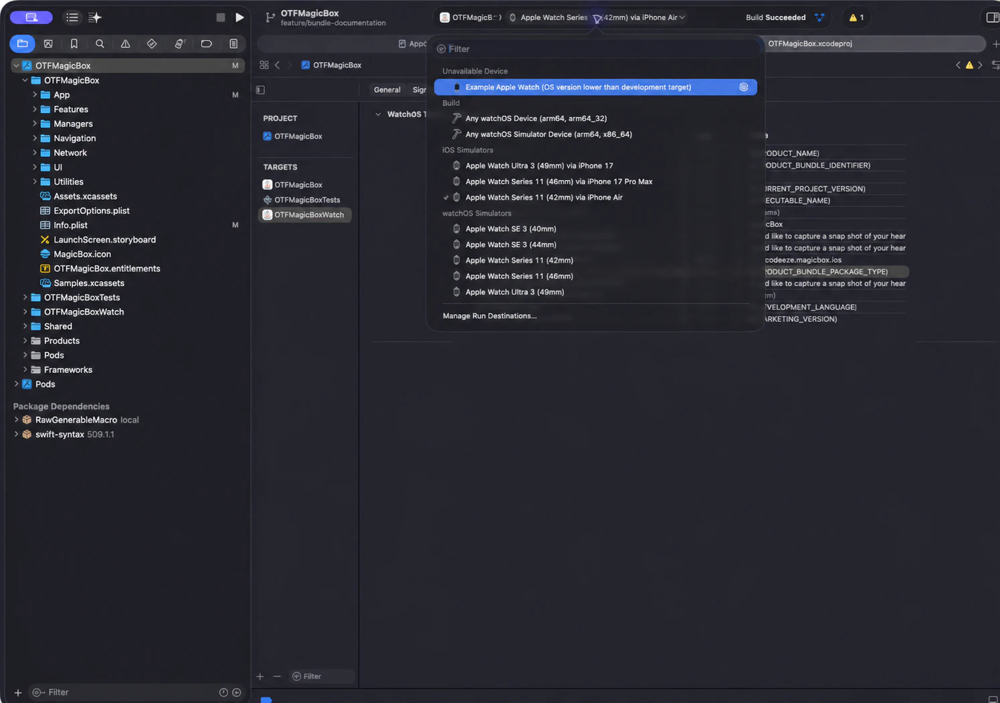

# Run MagicBox on a Physical iPhone and Apple Watch

This guide takes you from having no Apple developer setup to running MagicBox on your own iPhone and paired Apple Watch. You do not need to know how code signing works. Xcode can create the required development certificate and profiles for you.

The screenshots use these examples:

- iPhone app: `com.codeeze.magicbox.ios`
- Apple Watch app: `com.codeeze.magicbox.ios.watchkit`

Do not copy those exact identifiers. Replace `codeeze` with your name, company, or another value that makes the identifiers unique.

## What You Need

- A Mac running a macOS version supported by the Xcode release you choose.
- Xcode 16 or later that supports both your Mac and the operating-system versions installed on your iPhone and Apple Watch. Before downloading, check **Supported macOS Versions** and **Device Support** in Apple's [Xcode SDK and system requirements](https://developer.apple.com/xcode/system-requirements/) table. The [Mac App Store](https://apps.apple.com/app/xcode/id497799835) provides the current Xcode release; compatible older releases are available from [Apple Developer Downloads](https://developer.apple.com/download/all/).
- An iPhone running iOS 16.4 or later.
- For the Watch app, an Apple Watch running watchOS 9 or later and already paired with that iPhone.
- A data-capable USB cable for the first connection. A charging-only cable will not work.
- An internet connection while Xcode creates the signing files.
- An Apple Account. A free account is enough for basic testing on your own devices, with the limitations explained below.

Do not choose Xcode by version number alone. A newer Xcode may require a newer macOS release, while an older Xcode may not recognize the iOS or watchOS version on your devices.

Keep the iPhone and Apple Watch unlocked, charged, and near the Mac during the first installation. Turn on Wi-Fi and Bluetooth. For Watch preparation and debugging, the Mac, paired iPhone, and Apple Watch must be reachable on the same local network. If the Mac uses Ethernet, also keep its Wi-Fi connected to that network.

## 1. Choose a Free or Paid Apple Developer Account

### Free Apple Account (Personal Team)

A free Apple Account can install an app from Xcode on devices you own. You do not have to pay merely to try MagicBox on your own iPhone.

Apple currently applies these limits to a free Personal Team:

- Up to 10 App IDs, each expiring after 7 days.
- Up to 3 test devices, each registration expiring after 7 days.
- Up to 3 apps installed per device.
- The installation profile expires after 7 days. Run the app from Xcode again to rebuild and reinstall it.
- No TestFlight, App Store, or other app distribution.
- No full access to advanced Apple capabilities and services.

MagicBox uses Apple capabilities such as HealthKit, Associated Domains, AutoFill, and Sign in with Apple. Availability depends on the account type and the capabilities enabled in your copy of the project. If a Personal Team cannot create a signing profile, see [Personal Team reports an unsupported capability](#personal-team-reports-an-unsupported-capability).

Apple documents the current limits in [Developer account overview](https://developer.apple.com/help/account/basics/about-your-developer-account) and compares the account types in [Choosing a Membership](https://developer.apple.com/support/compare-memberships/).

### Apple Developer Program (Paid)

Use the paid program when you need the complete MagicBox capability set, TestFlight, App Store distribution, or a team that includes other developers. Apple lists the price as USD 99 per membership year, or the local equivalent. Eligible nonprofit, educational, and government organizations may request a fee waiver.

- [Apple Developer Program enrollment](https://developer.apple.com/programs/enroll/)
- [Membership details and benefits](https://developer.apple.com/programs/whats-included/)
- [Enrollment using the Apple Developer app](https://developer.apple.com/help/account/membership/enrolling-in-the-app/)

An individual membership publishes apps under the person's legal name. An organization membership publishes under the organization's legal name and normally requires a D-U-N-S Number. You do not need to enroll in the paid program if you only want to try the app and the Personal Team supports the capabilities you use.

## 2. Create or Register Your Apple Account

1. If you do not have an Apple Account, [create one on Apple's website](https://account.apple.com/account).
2. Turn on two-factor authentication for the account.
3. Sign in at [developer.apple.com/account](https://developer.apple.com/account/).
4. If Apple asks you to register as a developer or accept the Apple Developer Agreement, follow the instructions. This registration is free; it is not the paid Apple Developer Program enrollment.

Never put your Apple password, two-factor authentication code, signing certificate, or provisioning profile in the MagicBox repository.

If your company already has a paid developer team, ask its Account Holder or Admin to invite the Apple Account you will use. Accept the invitation before continuing.

## 3. Add the Apple Account to Xcode

1. Open Xcode.
2. Choose **Xcode > Settings** from the menu bar.
3. Select **Apple Accounts**.
4. Click **Add Apple Account…**.
5. Sign in and complete two-factor authentication.
6. Close Settings when the account appears in the list.

Xcode calls a free account a **Personal Team**. A paid individual or organization team appears using the member or organization name.

<p align="center"></p>

Your credentials are handled by Apple and Xcode; they are not added to the project.

## 4. Open MagicBox Correctly

If you have not installed the project yet, follow either the [recommended installer](../README.md#easy-installation-recommended) or the [manual installation](../README.md#manual-installation).

Always open `OTFMagicBox.xcworkspace`, not `OTFMagicBox.xcodeproj`, because MagicBox uses CocoaPods:

```bash
open OTFMagicBox.xcworkspace
```

Wait for Xcode to finish loading packages and indexing before changing signing settings.

## 5. Choose Your Three Identifiers

Every app needs a globally unique bundle identifier. It is a name used by Apple and is not shown under the app icon.

A simple pattern is:

| Place in Xcode | Example to replace | What it must contain |
| --- | --- | --- |
| `OTFMagicBox` Bundle Identifier | `com.yourname.magicbox.ios` | Your unique iPhone app ID |
| `OTFMagicBoxWatch` Bundle Identifier | `com.yourname.magicbox.ios.watchkit` | A different unique ID for the Watch app |
| `OTFMagicBoxWatch` `WKCompanionAppBundleIdentifier` | `com.yourname.magicbox.ios` | Exactly the same value as the iPhone app ID |

Use letters, numbers, hyphens, and periods; do not use spaces. A reverse-domain style such as `com.yourname.magicbox.ios` is conventional. You do not need to own a website, but the complete value must not already be registered by another Apple developer.

Write the two bundle identifiers down before continuing. The companion value is not a third unique ID—it is a copy of the iPhone ID.

## 6. Sign the iPhone Target

1. In Xcode's left navigator, click the blue **OTFMagicBox** project icon.
2. Under **TARGETS**, select **OTFMagicBox**.
3. Open **Signing & Capabilities**.
4. Select **All** so the setting applies to every build configuration.
5. Leave **Automatically manage signing** selected.
6. In **Team**, select your Personal Team or paid developer team.
7. Replace `org.theraforge.magicbox.ios` in **Bundle Identifier** with your unique iPhone identifier.
8. Configure or remove **Associated Domains** as explained below.
9. Wait until Xcode finishes updating the provisioning profile. A signing certificate should appear without a red error.

<p align="center"></p>

The screenshot uses `com.codeeze.magicbox.ios`. Your value must be different.

### Configure or Remove Associated Domains

MagicBox includes `webcredentials:stg.theraforge.org` under **Associated Domains**. That domain belongs to TheraForge and cannot authorize the new bundle identifier used by your fork. Changing only the bundle identifier can therefore allow the app to install while Password AutoFill and shared web credentials do not work.

Choose one of these options:

- If you do not need Password AutoFill or shared web credentials, remove the **Associated Domains** capability from the `OTFMagicBox` target.
- If you need those features, replace `webcredentials:stg.theraforge.org` with `webcredentials:` followed by a domain you control. On that website, serve an `apple-app-site-association` (AASA) file over HTTPS at `https://your-domain/.well-known/apple-app-site-association`. The file must have no filename extension or redirect, and its `webcredentials.apps` list must contain your Team ID followed by the exact iPhone bundle identifier:

```json
{
  "webcredentials": {
    "apps": [
      "TEAM_ID.com.yourname.magicbox.ios"
    ]
  }
}
```

Replace `TEAM_ID` with your Apple developer Team ID and replace the example bundle identifier with the exact value you entered under **Bundle Identifier**. You can find the Team ID in the Membership section of your Apple developer account. Apple explains both sides of this setup in [Configuring an associated domain](https://developer.apple.com/documentation/xcode/configuring-an-associated-domain) and [Supporting associated domains](https://developer.apple.com/documentation/xcode/supporting-associated-domains).

## 7. Sign the Apple Watch Target

1. Under **TARGETS**, select **OTFMagicBoxWatch**.
2. Stay in **Signing & Capabilities**.
3. Select **All**.
4. Leave **Automatically manage signing** selected.
5. Select the same **Team** used by the iPhone target.
6. Replace `org.theraforge.magicbox.ios.watchkit` with your unique Watch identifier.
7. Wait until the provisioning profile and signing certificate appear without a red error.

<p align="center"></p>

The screenshot uses `com.codeeze.magicbox.ios.watchkit`. Your value must be different.

## 8. Link the Watch App to the iPhone App

This step is essential. It tells watchOS which iPhone app owns the Watch companion.

1. Keep **OTFMagicBoxWatch** selected under **TARGETS**.
2. Open the **Info** tab.
3. Find `WKCompanionAppBundleIdentifier` in **WatchOS Target Properties**.
4. Replace `org.theraforge.magicbox.ios` with the exact iPhone bundle identifier from step 6.

For example, if the iPhone identifier is `com.yourname.magicbox.ios`, enter exactly `com.yourname.magicbox.ios` here. Do not add `.watchkit` to this field.

<p align="center"></p>

Before continuing, compare all three values with the table in step 5. A one-character mismatch is enough to stop the Watch app from installing.

## 9. Connect and Prepare the iPhone

1. Connect the unlocked iPhone to the Mac with a data-capable cable.
2. If the Mac asks whether to allow the accessory, choose **Allow**.
3. If the iPhone asks **Trust This Computer?**, tap **Trust** and enter the iPhone passcode. See Apple's [Trust This Computer guide](https://support.apple.com/en-us/109054) if the prompt does not appear.
4. In Xcode, choose **Window > Devices and Simulators** (called Device Hub in some Xcode documentation) and wait for the iPhone to finish preparing.
5. On the iPhone, open **Settings > Privacy & Security > Developer Mode**.
6. Turn on Developer Mode, approve the restart, then tap **Enable** after the iPhone restarts and enter the passcode.

Developer Mode may not appear in Settings until the iPhone has been paired with Xcode. If it is missing, reconnect the unlocked phone, open Xcode's device window, wait a moment, and check again. Apple explains the process in [Enabling Developer Mode on a device](https://developer.apple.com/documentation/xcode/enabling-developer-mode-on-a-device).

After the first cable pairing, Xcode may offer wireless connection. Keep using the cable until the first installation succeeds; it removes several possible connection problems.

## 10. Run MagicBox on the iPhone

1. In Xcode's top toolbar, select the **OTFMagicBox** scheme.
2. Open the run destination menu next to the scheme.
3. Under **iOS Device**, choose your physical iPhone, not a simulator.

<p align="center"></p>

The selected device name then appears in the toolbar:

<p align="center"></p>

4. Unlock the iPhone and keep its screen awake.
5. Click the triangular **Run** button or press **Command-R**.
6. Wait while Xcode builds, signs, installs, and starts MagicBox. The first build can take several minutes.
7. Approve any permission prompts that are relevant to the features you want to test.

Apple's [Running your app on simulated or physical devices](https://developer.apple.com/documentation/xcode/running-your-app-on-simulated-or-physical-devices) guide explains the same Xcode workflow in more detail.

## 11. Prepare and Run the Apple Watch App

The Apple Watch must already be paired with the same iPhone you prepared above.

1. Make sure the Mac, paired iPhone, and Apple Watch are reachable on the same local network. Wi-Fi being switched on is not enough if they are connected to isolated or different networks. If the Mac uses Ethernet, also connect its Wi-Fi to the same network as the iPhone and Watch.
2. Update the iPhone and Apple Watch to versions supported by your installed Xcode.
3. Keep the Watch unlocked, on your wrist if practical, and close to its paired iPhone.
4. On the Watch, open **Settings > Privacy & Security > Developer Mode**.
5. Turn on Developer Mode and approve the restart.
6. After the Watch restarts, tap **Turn On**. If asked, tap **Trust** and enter the Watch passcode.
7. First complete step 10 so the iPhone version of MagicBox is installed.
8. In Xcode's toolbar, change the scheme to **OTFMagicBoxWatch**.
9. Open the run destination menu and choose your physical Apple Watch. Xcode lists it through the paired iPhone.
10. Click **Run** or press **Command-R**.

The following screenshot shows where a physical Watch appears. In this example it is under **Unavailable Device** because its watchOS version is below the selected build's requirement. A compatible Watch appears as a selectable destination instead.

<p align="center"></p>

If the Watch companion does not install automatically, open the **Watch** app on the iPhone, find **Available Apps**, and install MagicBox. Then return to Xcode and run the `OTFMagicBoxWatch` scheme again.

## Troubleshooting

### “Failed Registering Bundle Identifier” or “identifier is not available”

The bundle identifier belongs to another developer or is not unique. Change it in the affected target. Add your name, organization, or another distinctive word, and remember to update `WKCompanionAppBundleIdentifier` when the iPhone ID changes.

### “Signing requires a development team”

Return to **Signing & Capabilities**, select **All**, and choose your team for both `OTFMagicBox` and `OTFMagicBoxWatch`. If the team is missing, open **Xcode > Settings > Apple Accounts**, sign in again, and confirm any new Apple agreements.

### Personal Team Reports an Unsupported Capability

A free account does not include full access to advanced capabilities. MagicBox intentionally demonstrates several Apple services, so a Personal Team may be unable to create a profile for every enabled feature.

You have two choices:

1. Use a paid Apple Developer Program team for the full feature set.
2. In your own fork, remove only capabilities that you do not plan to test from the target's **Signing & Capabilities** tab, then build again.

Removing a capability also disables the related feature. For example, do not remove HealthKit if you need health and activity data. Use Apple's [iOS capability table](https://developer.apple.com/help/account/reference/supported-capabilities-ios/) and [watchOS capability table](https://developer.apple.com/help/account/reference/supported-capabilities-watchos/) to check your account type.

### The iPhone Is Not Listed

- Unlock it and reconnect it with a cable that carries data.
- Approve **Allow Accessory** on the Mac and **Trust This Computer** on the iPhone.
- Open **Window > Devices and Simulators** and wait for preparation to finish.
- Try another cable or USB port.
- Restart Xcode and the iPhone.
- Make sure the iPhone's iOS version is supported by your installed Xcode.

### Developer Mode Is Missing or Disabled

Pair the device with Xcode first. Then look again under **Settings > Privacy & Security** on the iPhone or Apple Watch. Turning it on requires a device restart and a second confirmation after restart.

### The Watch Is Missing or Shown as Unavailable

- Confirm it is paired with the iPhone selected in Xcode.
- Confirm the Mac, paired iPhone, and Watch are reachable on the same local network; merely enabling Wi-Fi is not enough. If the Mac uses Ethernet, also connect its Wi-Fi to that network.
- Keep the Watch and iPhone close together with Bluetooth on.
- Temporarily disconnect VPNs and avoid guest Wi-Fi networks that isolate connected devices.
- Enable Developer Mode on both devices.
- Update watchOS and iOS, or install an Xcode version that supports their OS versions.
- Confirm the Watch meets MagicBox's minimum watchOS version.
- Check that the two Watch settings from steps 7 and 8 exactly match your iPhone identifier.

### The App Worked Last Week but No Longer Opens

This is expected with a free Personal Team. Its provisioning profile expires after 7 days. Connect the device, select it in Xcode, and press **Run** again. Xcode will rebuild and reinstall the app.

### Xcode Still Shows a Red Signing Error

Read the first red message from top to bottom; later messages are often consequences of the first one. Check these items in order:

1. The same team is selected for both targets.
2. Both bundle identifiers are unique.
3. `WKCompanionAppBundleIdentifier` exactly equals the iPhone bundle identifier.
4. **Automatically manage signing** is enabled.
5. The Mac is online and the Apple Account is still signed in.
6. The device is unlocked, trusted, and in Developer Mode.

## What Xcode Changes

With automatic signing enabled, Xcode registers the identifiers and devices that your account permits, creates a development certificate when needed, and generates development provisioning profiles. You do not need to export certificates or manually download profiles merely to run the app on your own devices.

The signing and identifier changes are saved in the Xcode project. If you maintain a fork, commit your organization's bundle identifiers only if they are intended to be shared with everyone working on that fork. Never commit credentials, private keys, or real API secrets.

For App Store or TestFlight distribution, continue with Apple's [distribution documentation](https://developer.apple.com/distribute/). Distribution is a separate process from the local device setup described here.
