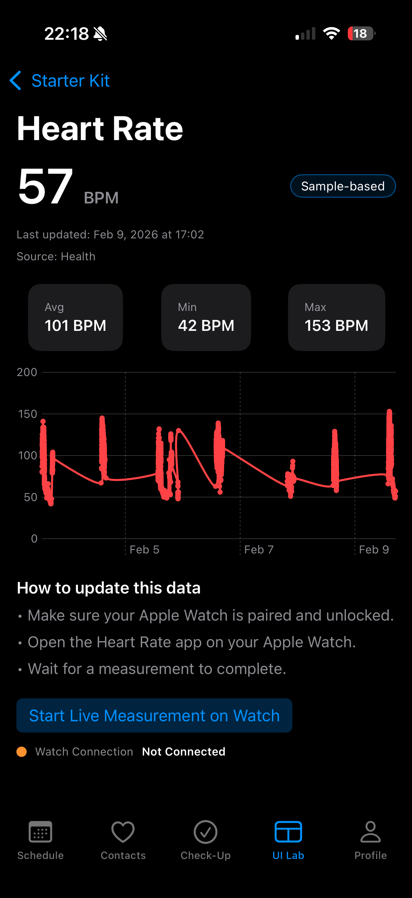

# Health Sensors — Onboarding Guide

This document is designed to guide users on how to use the Health Sensors feature in the **Theraforge MagicBox** application. It explains how the Health Sensors module works, how to initialize it, how to **customize text via YAML**, and how to use **DashboardCardView**, **GenericHealthCardView**, and **LiveHeartRateView**. Everything below references only the `HealthSensors` folder and its configuration files.

---

## 1) What Health Sensors Is

**Health Sensors** is an educational module located at:

- `OTFMagicBox/Features/UILab/HealthSensors/`

It showcases **health metric cards**, a **customizable dashboard**, and a simple flow for visualizing data. It is designed to teach:
- **YAML-based configuration**.
- **Reusable SwiftUI views**.
- **Health metrics and states**.

---

## 2) Health Sensors Structure

Key files in the module:

- `OTFMagicBox/Features/UILab/HealthSensors/Models/HealthSensorsConfiguration.yml`
  - **All user-facing text and labels** for Health Sensors.

- `OTFMagicBox/Features/UILab/HealthSensors/Models/HealthSensorsConfiguration.swift`
  - **Swift model** that represents the YAML file.

- `OTFMagicBox/Features/UILab/HealthSensors/Models/HealthSensorsConfigurationLoader.swift`
  - **Loader** that reads YAML and provides the configuration.

- `OTFMagicBox/Features/UILab/HealthSensors/Screens/HealthSensorsListView.swift`
  - **Entry screen** for the Health Sensors module.

- `OTFMagicBox/Features/UILab/HealthSensors/Cards/DashboardCardView.swift`
  - **Dashboard** that shows selected metrics.

- `OTFMagicBox/Features/UILab/HealthSensors/Cards/GenericHealthCardView.swift`
  - **Generic metric card** for displaying health data.

- `OTFMagicBoxWatch/Features/HeartRate/LiveHeartRateView.swift`
  - **Live heart rate view** for Apple Watch.

---

## 3) How to Initialize Health Sensors (step by step)

Health Sensors does **not depend on other app features**. In the app UI, the entry point is now under **UI Lab → CoreMotion → Health Sensors**, which navigates to `HealthSensorsListView`.

### Basic initialization

The official loader is:

- `OTFMagicBox/Features/UILab/HealthSensors/Models/HealthSensorsConfigurationLoader.swift`

It exposes:

```swift
HealthSensorsConfigurationLoader.config
```

This object includes a fallback and reads the YAML automatically.

### Simple example

```swift
let config = HealthSensorsConfigurationLoader.config
// Use config for Health Sensors titles, labels, and text
```

The **entry screen** uses this configuration directly:

- `HealthSensorsListView` loads `config` and applies titles, callouts, and labels.

---

## 4) How to Customize Text with YAML

All Health Sensors text lives in:

- `OTFMagicBox/Features/UILab/HealthSensors/Models/HealthSensorsConfiguration.yml`

The file is multilingual (e.g., `en`, `pt`, `ar`). Example:

```yaml
title:
  en: "Health Sensors"
  pt: "Health Sensors"
  ar: "مستشعرات الصحة"
```

### What you can customize

You can update:
- **Module title** (`title`).
- **Callout content** (`calloutTitle`, `calloutBody`).
- **Status messages** (`statusNeedsPermission`, `statusLive`, etc.).
- **Card titles and subtitles** (`cardTitleHeartRate`, `cardSubtitleHeartRate`, ...).
- **Units** (`unitBPM`, `unitMmHg`, `unitPercent`, ...).
- **Empty-state messages** (`emptyMessageHeartRate`, ...).
- **Guidance steps** (`guidanceHeartRateStep1`, ...).

### How to edit safely

1. Open the YAML file.
2. Update only the text for the language you want.
3. **Keep indentation at 2 spaces**.
4. Save and run the app.

---

## 5) How to Use Health Sensors in Practice

### Entry screen

The main Health Sensors entry is:

- `OTFMagicBox/Features/UILab/HealthSensors/Screens/HealthSensorsListView.swift`

It shows:
- An **educational callout** (text from YAML).
- A link to **DashboardCardView**.
- A list of metric cards.

### DashboardCardView

File:
- `OTFMagicBox/Features/UILab/HealthSensors/Cards/DashboardCardView.swift`

`DashboardCardView`:
- Shows **selected metrics** in a grid.
- Displays an **empty state** when nothing is selected.
- Uses YAML labels (`dashboardTitle`, `dashboardEmpty`, etc.).

When students open the dashboard:
- `DashboardCardViewModel` manages the selected metrics.
- The screen uses `HealthSensorsConfiguration` for all copy.

### GenericHealthCardView

File:
- `OTFMagicBox/Features/UILab/HealthSensors/Cards/GenericHealthCardView.swift`

`GenericHealthCardView`:
- Renders **one specific metric**.
- Displays a primary value + unit.
- Shows secondary metrics (min, max, average).
- Presents **guidance steps** from YAML.
- Requests **authorization to read data from the Health app** when needed.
- Includes permission and **live measurement** actions when the metric is heart rate.

All text is taken from `HealthSensorsConfiguration.yml`.

---

## 6) Examples (add your images here)

Use this section to document visual results as you build. You can insert images of the cards to help classmates compare their UI with expected output.

### Heart Rate Card

The Heart Rate card is a **GenericHealthCardView** configured for the **Heart Rate** metric. It displays:
- A primary BPM value with unit.
- Secondary metrics (min, max, average).
- Guidance steps from the YAML for how to capture data.
- Health authorization prompts when access is not granted.

<p align="center"></p>

---

## 6) Supported Metrics (Health Sensors)

Metrics are defined by titles in the YAML file:

- **Heart Rate**
- **Blood Glucose**
- **Blood Pressure**
- **ECG**
- **Respiratory Rate**
- **Resting Heart Rate**
- **Oxygen Saturation**
- **VO₂ Max**

Each metric includes:
- A title and subtitle.
- A unit (e.g., `BPM`, `mmHg`, `%`).
- Empty-state messaging.
- Step-by-step guidance on how to capture the data.

All of this is configured in:
- `OTFMagicBox/Features/UILab/HealthSensors/Models/HealthSensorsConfiguration.yml`

---

## 7) LiveHeartRateView (Apple Watch)

Health Sensors also includes a **live heart rate experience** on Apple Watch:

- `OTFMagicBoxWatch/Features/HeartRate/LiveHeartRateView.swift`

This view:
- Shows a **pulsing heart** animation.
- Displays heart rate in **BPM**.
- Starts and stops sessions by tapping the heart.

It is a strong learning example for:
- Simple watchOS UI.
- State-driven animation.
- Health metric streaming.

---

## 8) Mock Data in Health Sensors (what it is and how to use it)

Health Sensors includes **built‑in mock data** so students can explore the UI without needing real Health data. This is intentionally designed for classroom and lab environments where HealthKit data may be unavailable.

### Where mock data is controlled

In `HealthSensorsListView`, the **Settings** menu provides:
- **Mock Data** toggle — enables or disables simulated values.
- **Reset Mock Seed** — re‑randomizes the mock dataset so charts and cards look different on each run.

These controls are backed by app storage keys and are intended for **repeatable classroom demos**.

### What mock data affects

When mock mode is enabled:
- **Card values** show plausible metric readings (e.g., BPM, mmHg, %).
- **Charts** display sample time series, so graphs and trends are visible.
- **Secondary metrics** (min, max, average) are computed from the simulated data.
- **Empty states** are avoided, which helps students focus on UI and flow.

When mock mode is disabled, cards fall back to:
- **Live Health data** (if permission is granted and data exists), or
- **Empty states / guidance steps** (if data is missing).

### How to use mock data in research prototypes

For university research prototypes, mock data is ideal for:
- **User testing** of UI flows before real data is available.
- **Classroom demonstrations** where privacy constraints block real Health data.
- **Consistency across teams**, since everyone can enable mock mode with the same flow.

If you need to compare mock results across students, ask everyone to:
1. Turn on **Mock Data**.
2. Use **Reset Mock Seed** once at the start of the session.
3. Keep the same configuration YAML while testing.

If your university requires ethics or consent workflows, implement those **outside** Health Sensors. Health Sensors' responsibility is UI + configuration, not governance.

---

## 9) Sensor Tasks in Schedule (`SensorTaskCard`)

Health Sensors also powers **sensor tasks** in Schedule. These tasks are displayed as `SensorTaskCard` and allow users to send a health measurement as a CareKit outcome.

### SensorTaskCard

File:
- `OTFMagicBox/Features/Schedule/Components/SensorsTasks/SensorTaskCard.swift`

The card:
- Shows the task title and instructions.
- Shows a main action button.
- Sends the result directly when a metric value is available.
- Opens the detail screen for review when needed.

### How to add a sensor task from `MockSensorTaskView`

1. Open **Schedule** and tap **Sensors** in the toolbar.
2. The app presents `OTFMagicBox/Features/Schedule/Components/SensorsTasks/MockSensorTaskView.swift`.
3. Select one metric from the list.
4. A sensor task is created in CareKit for the selected date.

### Sending outcomes from sensor cards

Outcomes can be sent in two ways:
- From `SensorTaskCard` directly.
- From the detail card (`GenericHealthCardView`) after review.

After sending:
- The value is stored as a CareKit outcome for that task occurrence.
- The task is shown as sent/completed for the day.
- The card can show the sent value using the configured format.

### Configuration map for sensor tasks

- `OTFMagicBox/Features/Schedule/Models/SensorTaskConfiguration.yml`
  - Sensor-task copy: action labels, sent-value format, mock picker title, and per-metric task titles/instructions.

- `OTFMagicBox/Features/UILab/HealthSensors/Models/HealthSensorsConfiguration.yml`
  - Metric text used by sensor task flows: titles, subtitles, symbols, units, and outcome button/hint labels.

---

## 10) Common Setup Pitfalls (and how to avoid them)

- **YAML decoding errors**: Never rename keys in `HealthSensorsConfiguration.yml`. Changing a key name breaks decoding.
- **Indentation mistakes**: Use **2 spaces** for all YAML nesting.
- **Language drift**: Keep `en` updated as the reference language, then adjust other languages.
- **Empty data screens**: If you see “No Data,” confirm Health permissions are granted and that the metric exists in the Health app.
- **Watch data not streaming**: Confirm the Apple Watch is paired, unlocked, and the Heart Rate app is available.

---

## 11) Beginner Exercises (recommended)

These exercises are designed for first‑time iOS developers:

1. **Edit one title** in `HealthSensorsConfiguration.yml`, run the app, and verify the change in `HealthSensorsListView`.
2. **Change a unit label** (e.g., `unitBPM`) and confirm it appears in `GenericHealthCardView`.
3. **Update a guidance step** for Heart Rate and observe it in the guidance section.
4. **Switch mock data** on/off in the Health Sensors settings menu and note how cards change.
5. **Open LiveHeartRateView** on Apple Watch (or use the simulator) and start/stop a session.

---

## 12) Configuration and Personalization — Quick Checklist

Use this checklist when working with Health Sensors:

- Edited `HealthSensorsConfiguration.yml` for text and labels.
- Reviewed `HealthSensorsConfiguration.swift` to understand the model.
- Used `HealthSensorsConfigurationLoader.config` for copy.
- Opened `HealthSensorsListView` as the entry.
- Navigated to `DashboardCardView` and `GenericHealthCardView`.
- Verified `LiveHeartRateView` behavior on watchOS.

---

## 13) Tips for Beginner Students

- **Do not edit the loader** until you understand the YAML.
- **Make small changes**: update one string and test.
- **Keep language keys consistent** across the YAML.
- **Do not rename YAML keys** (it will break decoding).

---

## Conclusion

Health Sensors is a focused educational module for **health metric cards** and **data visualization**, driven by YAML configuration and reusable SwiftUI views. For university students, it is a practical way to learn:
- External configuration management.
- SwiftUI module structure.
- iOS + watchOS UI patterns.

Once you understand the flow from **Health Sensors → YAML → Views**, you are ready to extend the module with additional metrics or custom cards.
