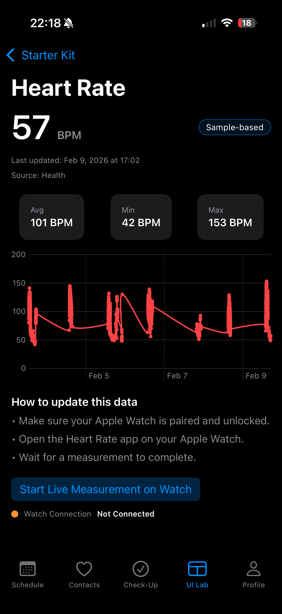

# Health Sensors — Onboarding Guide

This document is designed to guide users on how to use the Health Sensors feature in the **Theraforge MagicBox** application. It explains how the Health Sensors module works, how to initialize it, how to **customize text via YAML**, and how to use **HealthSensorsListView**, **GenericHealthCardView**, and **LiveHeartRateView**. Everything below references only the `HealthSensors` folder and its configuration files.

---

## 1) What Health Sensors Is

**Health Sensors** is an educational module located at:

- `OTFMagicBox/Features/UILab/HealthSensors/`

It showcases **health metric cards**, a metric list, and a simple flow for visualizing data. It is designed to teach:
- **YAML-based configuration**.
- **Reusable SwiftUI views**.
- **Health metrics and states**.

---

## 2) Health Sensors Structure

Key files in the module:

- `OTFMagicBox/Features/UILab/HealthSensors/Models/HealthSensorsConfiguration.yml`
  - **All user-facing text and labels** for Health Sensors.

- `OTFMagicBox/Features/UILab/HealthSensors/Models/HealthSensorsConfiguration.swift`
  - **Swift model** that represents the YAML file.

- `OTFMagicBox/Features/UILab/HealthSensors/Models/HealthSensorsConfigurationLoader.swift`
  - **Loader** that reads YAML and provides the configuration.

- `OTFMagicBox/Features/UILab/HealthSensors/Screens/HealthSensorsListView.swift`
  - **Entry screen** for the Health Sensors module.

- `OTFMagicBox/Features/UILab/HealthSensors/Components/CardRowView.swift`
  - **Metric row** that previews the latest or placeholder value for each configured card.

- `OTFMagicBox/Features/UILab/HealthSensors/Screens/GenericHealthCardView.swift`
  - **Generic metric card** for displaying health data.

- `OTFMagicBoxWatch/Features/HeartRate/LiveHeartRateView.swift`
  - **Live heart rate view** for Apple Watch.

---

## 3) How to Initialize Health Sensors (step by step)

Health Sensors does **not depend on other app features**. In the app UI, the entry point is now under **UI Lab → CoreMotion → Health Sensors**, which navigates to `HealthSensorsListView`.

### Basic initialization

The official loader is:

- `OTFMagicBox/Features/UILab/HealthSensors/Models/HealthSensorsConfigurationLoader.swift`

It exposes:

```swift
HealthSensorsConfigurationLoader.config
```

This object includes a fallback and reads the YAML automatically.

### Simple example

```swift
let config = HealthSensorsConfigurationLoader.config
// Use config for Health Sensors titles, labels, and text
```

The **entry screen** uses this configuration directly:

- `HealthSensorsListView` loads `config` and applies the navigation title and settings menu labels.

---

## 4) How to Customize Text with YAML

All Health Sensors text lives in:

- `OTFMagicBox/Features/UILab/HealthSensors/Models/HealthSensorsConfiguration.yml`

The file is multilingual (e.g., `en`, `pt`, `ar`). Example:

```yaml
title:
  en: "Health Sensors"
  pt: "Health Sensors"
  ar: "مستشعرات الصحة"
```

### What you can customize

You can update:
- **Module title** (`title`).
- **Callout content** (`calloutTitle`, `calloutBody`).
- **Status messages** (`statusNeedsPermission`, `statusLive`, etc.).
- **Card titles and subtitles** (`cardTitleHeartRate`, `cardSubtitleHeartRate`, ...).
- **Units** (`unitBPM`, `unitMmHg`, `unitPercent`, ...).
- **Empty-state messages** (`emptyMessageHeartRate`, ...).
- **Guidance steps** (`guidanceHeartRateStep1`, ...).

### How to edit safely

1. Open the YAML file.
2. Update only the text for the language you want.
3. **Keep indentation at 2 spaces**.
4. Save and run the app.

---

## 5) How to Use Health Sensors in Practice

### Entry screen

The main Health Sensors entry is:

- `OTFMagicBox/Features/UILab/HealthSensors/Screens/HealthSensorsListView.swift`

It shows:
- A list of metric cards.
- A settings menu for mock data.
- Navigation to each metric detail card.

### CardRowView

File:
- `OTFMagicBox/Features/UILab/HealthSensors/Components/CardRowView.swift`

`CardRowView`:
- Shows the metric symbol, title, value, and detail text.
- Displays placeholder styling when live or mock values are unavailable.
- Starts and stops its `CardRowViewModel` with the row lifecycle.

When students open Health Sensors:
- `HealthSensorsListView` reads the configured cards from `CardRegistry`.
- `CardRowViewModel` loads preview values for each row.
- The screen uses `HealthSensorsConfiguration` for navigation and menu copy.

### GenericHealthCardView

File:
- `OTFMagicBox/Features/UILab/HealthSensors/Screens/GenericHealthCardView.swift`

`GenericHealthCardView`:
- Renders **one specific metric**.
- Displays a primary value + unit.
- Shows secondary metrics (min, max, average).
- Presents **guidance steps** from YAML.
- Requests **authorization to read data from the Health app** when needed.
- Includes permission and **live measurement** actions when the metric is heart rate.

All text is taken from `HealthSensorsConfiguration.yml`.

---

## 6) Metric Card Example

Use this section to document visual results as you build. You can insert images of the cards to help classmates compare their UI with expected output.

### Heart Rate Card

The Heart Rate card is a **GenericHealthCardView** configured for the **Heart Rate** metric. It displays:
- A primary BPM value with unit.
- Secondary metrics (min, max, average).
- Guidance steps from the YAML for how to capture data.
- Health authorization prompts when access is not granted.

<p align="center"></p>

---

## 7) Supported Metrics (Health Sensors)

Metrics are defined by titles in the YAML file:

- **Heart Rate**
- **Blood Glucose**
- **Blood Pressure**
- **ECG**
- **Respiratory Rate**
- **Resting Heart Rate**
- **Oxygen Saturation**
- **VO₂ Max**

Each metric includes:
- A title and subtitle.
- A unit (e.g., `BPM`, `mmHg`, `%`).
- Empty-state messaging.
- Step-by-step guidance on how to capture the data.

All of this is configured in:
- `OTFMagicBox/Features/UILab/HealthSensors/Models/HealthSensorsConfiguration.yml`

---

## 8) LiveHeartRateView (Apple Watch)

Health Sensors also includes a **live heart rate experience** on Apple Watch:

- `OTFMagicBoxWatch/Features/HeartRate/LiveHeartRateView.swift`

This view:
- Shows a **pulsing heart** animation.
- Displays heart rate in **BPM**.
- Starts and stops sessions by tapping the heart.

It is a strong learning example for:
- Simple watchOS UI.
- State-driven animation.
- Health metric streaming.

---

## 9) Mock Data in Health Sensors (what it is and how to use it)

Health Sensors includes **built‑in mock data** so students can explore the UI without needing real Health data. This is intentionally designed for classroom and lab environments where HealthKit data may be unavailable.

### Where mock data is controlled

In `HealthSensorsListView`, the **Settings** menu provides:
- **Mock Data** toggle — enables or disables simulated values.
- **Reset Mock Seed** — re‑randomizes the mock dataset so charts and cards look different on each run.

These controls are backed by app storage keys and are intended for **repeatable classroom demos**.

### What mock data affects

When mock mode is enabled:
- **Card values** show plausible metric readings (e.g., BPM, mmHg, %).
- **Charts** display sample time series, so graphs and trends are visible.
- **Secondary metrics** (min, max, average) are computed from the simulated data.
- **Empty states** are avoided, which helps students focus on UI and flow.

When mock mode is disabled, cards fall back to:
- **Live Health data** (if permission is granted and data exists), or
- **Empty states / guidance steps** (if data is missing).

### How to use mock data in research prototypes

For university research prototypes, mock data is ideal for:
- **User testing** of UI flows before real data is available.
- **Classroom demonstrations** where privacy constraints block real Health data.
- **Consistency across teams**, since everyone can enable mock mode with the same flow.

If you need to compare mock results across students, ask everyone to:
1. Turn on **Mock Data**.
2. Use **Reset Mock Seed** once at the start of the session.
3. Keep the same configuration YAML while testing.

If your university requires ethics or consent workflows, implement those **outside** Health Sensors. Health Sensors' responsibility is UI + configuration, not governance.

---

## 10) Sensor Tasks in Schedule (`SensorTaskCard`)

Health Sensors also powers **sensor tasks** in Schedule. Each supported metric has a Sensor task that reads Apple Health and a Manual task that collects the same fields in a form. Both variants require the user to review or submit data. They create CareKit outcomes only; manual values are not written to Apple Health.

### Schedule `viewType` values

Existing values select the Sensor experience. The corresponding `manual*` value selects the manual form:

| Metric | Sensor | Manual |
|---|---|---|
| Heart Rate | `heartRate` | `manualHeartRate` |
| Blood Glucose | `bloodGlucose` | `manualBloodGlucose` |
| Blood Pressure | `bloodPressure` | `manualBloodPressure` |
| ECG | `ecg` | `manualECG` |
| Respiratory Rate | `respiratoryRate` | `manualRespiratoryRate` |
| Resting Heart Rate | `restingHeartRate` | `manualRestingHeartRate` |
| Oxygen Saturation | `oxygenSaturation` | `manualOxygenSaturation` |
| VO₂ Max | `vo2Max` | `manualVO2Max` |

### SensorTaskCard

File:
- `OTFMagicBox/Features/Schedule/Components/SensorsTasks/SensorTaskCard.swift`

The card:
- Shows the task title and instructions.
- Identifies the task as Sensor or Manual.
- Lets Sensor tasks quick-send the complete latest Health record.
- Opens Sensor details for charts, full sample metadata, notes, and review.
- Opens manual details as a validated metric-specific form.
- Shows a metric-specific submitted summary such as `118/76 mmHg`.

### How to add a sensor task from `MockSensorTaskView`

1. Open **Schedule** and tap **Sensors** in the toolbar.
2. The app presents `OTFMagicBox/Features/Schedule/Components/SensorsTasks/MockSensorTaskView.swift`.
3. Select one metric from either the **Sensor** or **Manual Entry** section.
4. A sensor task is created in CareKit for the selected date.

### Sending outcomes from sensor cards

Sensor outcomes can be quick-sent from `SensorTaskCard` or reviewed with optional notes in the detail screen. Manual outcomes are submitted from the metric-specific form. The detail screen reloads the selected task occurrence after local or remote store notifications, so a submitted result remains visible independently of current HealthKit data or authorization.

After sending:
- The complete named value array is stored as a CareKit outcome for that task occurrence.
- The task is shown as sent/completed for the day.
- The card and detail screen decode the same saved values.

### Outcome value contract

Every new `OCKOutcomeValue` has a stable `kind`. Values are ordered as measurement fields, `date`, `entryMode`, and optional `notes`. `entryMode` is exactly `sensor` or `manual`; blank notes are omitted. Outcomes previously stored with `automatic` decode as Sensor for compatibility.

| Metric | Ordered measurement values |
|---|---|
| Heart Rate | `bpm` Double (`BPM`) |
| Blood Glucose | `mgPerdL` Double (`mg/dL`) |
| Blood Pressure | `systolic` Double (`mmHg`), `diastolic` Double (`mmHg`), `unit` String (`mmHg`) |
| ECG | `classification` Int (HealthKit raw value), optional `averageBPM` Double (`BPM`), optional `samplingHz` Double (`Hz`), optional `duration` Double (`s`) |
| Respiratory Rate | `breathsPerMin` Double (`br/min`) |
| Resting Heart Rate | `bpm` Double (`BPM`) |
| Oxygen Saturation | `percent` Double (`%`) |
| VO₂ Max | `mlPerKgMin` Double (`mL/(kg·min)`) |

The common trailing values are `date` as `Date`, `entryMode` as `String`, and optional `notes` as `String`. Units are canonical persisted constants, not localized display strings. Legacy unnamed single-value outcomes remain readable and appear with an unknown entry mode.

### Secure generated ECG report attachment

For a Sensor ECG, MagicBox also reads the public HealthKit voltage measurements for the selected `HKElectrocardiogram` and generates its own one-page PDF. The report contains three 10-second Lead I strips at standard `25 mm/s` and `10 mm/mV` scale. It is explicitly identified as a MagicBox-generated report and is not the PDF exported by the Apple Health app, which HealthKit does not expose.

When report generation succeeds, MagicBox encrypts the PDF with a per-file key, wraps that key with the user's StorageBox key, uploads the encrypted bytes through the existing secure-document API, and stores only this reference after the ECG measurement fields and before `date`:

| Kind | CareKit type | Required | Value |
|---|---|---|---|
| `healthKitSampleUUID` | String | No | HealthKit ECG sample UUID; absent for mock data |
| `lead` | String | Yes | `appleWatchSimilarToLeadI` |
| `ecgReportFormat` | String | Yes | `magicbox-ecg-pdf-v1` |
| `ecgReportMimeType` | String | Yes | `application/pdf` |
| `ecgReportAttachmentID` | String | Yes | StorageBox secure attachment identifier |
| `ecgReportFileName` | String | Yes | Generated PDF file name |
| `ecgReportEncryptedFileKey` | String | Yes | Random file key wrapped by StorageBox/CryptoBox |
| `ecgReportHashFileKey` | String | Yes | Integrity hash that binds the wrapped key to this outcome |

The report is optional so an ECG scalar outcome can still be submitted if HealthKit voltage retrieval or report rendering fails. Manual ECG outcomes never contain a waveform or report because they are not backed by a HealthKit ECG sample.

The PDF is never persisted in the CareKit outcome or cached by MagicBox. StorageBox stores ciphertext together with the wrapped file key and integrity hash; the outcome retains the same wrapped-key metadata so a later response can be bound to the original upload. When the patient opens a submitted ECG result, MagicBox verifies the attachment identity and metadata, verifies its integrity, decrypts it in memory through the shared CryptoBox-compatible implementation, and renders the report. Plaintext sharing uses a `Transferable` data representation rather than an app-owned temporary PDF. A failed outcome write removes the newly uploaded orphan attachment, interrupted uploads are recorded for reconciliation on the next store initialization, and deleting a local outcome or task removes its referenced attachment.

#### Clinician access prerequisite

The current secure-document API wraps one random file key with the patient's default StorageBox key. A clinician dashboard does not possess that symmetric patient key, so an attachment ID by itself is intentionally insufficient to decrypt the report. End-to-end clinician viewing requires a backend/CryptoBox sharing contract before the dashboard can display the PDF:

1. Resolve the care-team recipients who are authorized for the outcome.
2. Re-wrap the random ECG file key for each recipient's public key, without sending the plaintext PDF or plaintext file key to the backend.
3. Return only the requesting recipient's wrapped key after authorization checks.
4. Revoke or rotate recipient access when care-team membership changes.
5. Cascade attachment deletion when an outcome/task is deleted remotely, since an unknown remote-store change does not carry the deleted outcome values back to the app.

Until that contract exists, the patient app can upload, restore, preview, and share its own report securely, while the portal should show the scalar ECG fields and an unavailable/pending-report state instead of attempting server-side decryption.

The dashboard outcome page should:

- Continue showing the existing ECG key fields (`classification`, `averageBPM`, `samplingHz`, `duration`, `date`, `entryMode`, and optional `notes`).
- Detect `ecgReportFormat == magicbox-ecg-pdf-v1`, `ecgReportMimeType == application/pdf`, and `ecgReportAttachmentID`.
- Preserve `ecgReportEncryptedFileKey` and `ecgReportHashFileKey` as opaque, security-sensitive attachment metadata; do not render them as clinical values.
- Use the authorized secure-document download flow for `ecgReportAttachmentID`; the backend continues to store only encrypted content and must not decrypt the report as part of ordinary outcome processing.
- Provide an embedded preview or download action only after the recipient key-sharing prerequisite above is implemented and the client has unwrapped the file key locally.
- Treat the report fields as optional and continue displaying scalar-only, manual, and legacy ECG outcomes.
- Label the file as generated by MagicBox rather than as an Apple Health PDF.

### UI Lab examples

UI Lab → Health Sensors contains one list of eight metrics. Each detail screen has a **Sensor / Manual** segmented control. Sensor examples retain HealthKit/mock charts; Manual shows the form. Submitting either example displays the exact in-memory outcome array and does not write to CareKit.

### Configuration map for sensor tasks

- `OTFMagicBox/Features/Schedule/Models/SensorTaskConfiguration.yml`
  - Sensor-task copy: action labels, sent-value format, mock picker title, and per-metric task titles/instructions.

- `OTFMagicBox/Features/UILab/HealthSensors/Models/HealthSensorsConfiguration.yml`
  - Metric text used by sensor task flows: titles, subtitles, symbols, units, and outcome button/hint labels.

---

## 11) Common Setup Pitfalls (and how to avoid them)

- **YAML decoding errors**: Never rename keys in `HealthSensorsConfiguration.yml`. Changing a key name breaks decoding.
- **Indentation mistakes**: Use **2 spaces** for all YAML nesting.
- **Language drift**: Keep `en` updated as the reference language, then adjust other languages.
- **Empty data screens**: If you see “No Data,” confirm Health permissions are granted and that the metric exists in the Health app.
- **Watch data not streaming**: Confirm the Apple Watch is paired, unlocked, and the Heart Rate app is available.

---

## 12) Beginner Exercises (recommended)

These exercises are designed for first‑time iOS developers:

1. **Edit one title** in `HealthSensorsConfiguration.yml`, run the app, and verify the change in `HealthSensorsListView`.
2. **Change a unit label** (e.g., `unitBPM`) and confirm it appears in `GenericHealthCardView`.
3. **Update a guidance step** for Heart Rate and observe it in the guidance section.
4. **Switch mock data** on/off in the Health Sensors settings menu and note how cards change.
5. **Open LiveHeartRateView** on Apple Watch (or use the simulator) and start/stop a session.

---

## 13) Configuration and Personalization — Quick Checklist

Use this checklist when working with Health Sensors:

- Edited `HealthSensorsConfiguration.yml` for text and labels.
- Reviewed `HealthSensorsConfiguration.swift` to understand the model.
- Used `HealthSensorsConfigurationLoader.config` for copy.
- Opened `HealthSensorsListView` as the entry.
- Navigated through `CardRowView` previews and `GenericHealthCardView` details.
- Verified `LiveHeartRateView` behavior on watchOS.

---

## 14) Tips for Beginner Students

- **Do not edit the loader** until you understand the YAML.
- **Make small changes**: update one string and test.
- **Keep language keys consistent** across the YAML.
- **Do not rename YAML keys** (it will break decoding).

---

## Conclusion

Health Sensors is a focused educational module for **health metric cards** and **data visualization**, driven by YAML configuration and reusable SwiftUI views. For university students, it is a practical way to learn:
- External configuration management.
- SwiftUI module structure.
- iOS + watchOS UI patterns.

Once you understand the flow from **Health Sensors → YAML → Views**, you are ready to extend the module with additional metrics or custom cards.
