# TheraForge MagicBox

The Open TheraForge (OTF) MagicBox app is a template for creating digital health solutions that help people better manage their health.

This sample application leverages TheraForge frameworks such as [OTFTemplateBox](../../../OTFTemplateBox) to implement a no-code solution that can be customized without requiring any code changes.

For more details on the features of the SDK and on the TheraForge Cloud setup process (e.g., to obtain an API key), refer to the [OTFToolBox](../../../OTFToolBox) Readme file.

## Why iOS 16.4?

MagicBox requires **iOS 16.4+** to take advantage of modern iOS APIs while reducing legacy compatibility code:
- **Enhanced SwiftUI**: Leverage new view modifiers for richer, resizable sheet experiences and interactive backgrounds.
- **Improved Security**: Benefit from the latest platform security and privacy features.
- **Improved Performance**: Take advantage of optimizations in the latest Swift and SwiftUI runtimes.
- **SF Symbols 4.2+ Support**: Access thousands of consistent, high-quality icons with advanced rendering.

## Change Log

<details open>
  <summary><strong>Release 2.0.0</strong></summary>
  
  ### Breaking Changes
  - **Minimum iOS Version Update**: MagicBox now requires **iOS 16.4** or later. Devices running older iOS versions are no longer supported.
  
  ### Added
  - **Modular Configuration**: YAML configuration is now split per feature under `OTFMagicBox/Features/*/Models/*Configuration.yml` rather than using monolithic files.
  - **Extended Localization**: Full support for **Arabic (AR) RTL** alongside English (EN) and Portuguese (PT).
  - **UI Lab + Snippet Playground**: The UI tab is now **UI Lab**, including component/SDK demos and a snippets playground that can also be used as the root of the app via `playgroundMode`.
  - **Xcode Code Snippets**: Added a curated ResearchKit snippets pack under `Snippets/` and an installer script (`Scripts/install_snippets.rb`).
  - **Terms & Privacy Support**: Added new support for Terms of Service and Privacy Policy documents.
  
  ### Changed
  - **Performance Improvements**: Significant performance improvements across the entire app.
  - **Offline-First Architecture**: Reduced network calls and improved synchronization logic to support a robust offline-first system.
  - **Diagnostics**: Improved log viewing, filtering, and export capabilities. Configuration is now in `OTFMagicBox/Features/Logger/Models/LogConfiguration.yml`.
  - **Profile Layout**: Refined profile screen with clearer sections.
  
  ### Fixed
  - **Bug Fixes**: Addressed several bugs and stability issues throughout the application.
</details>

<details>
  <summary>Release 1.0.6-beta</summary>
  
  - **Minimum iOS Version Update**
    - MagicBox now requires iOS 16.0 or later.
    - Devices running older iOS versions are no longer supported.
    - See "Why iOS 16?" section above for details on the advantages of this update.
  
  <!-- Other release notes here -->
</details>

<details>
  <summary>Release 1.0.5-beta</summary>
  
  - **New Profile Layout**
    - The profile page has been redesigned to align more closely with the layout seen in Apple's apps, like the Health app, for a more familiar and intuitive experience.
    - Despite the new design, all existing features are preserved, including the ability to update profile details, view support contact information, and change the account password.
    - A dedicated page now displays key user information such as name, birthdate, and gender. Users can edit these details directly on this page. Additionally, users can update their profile picture by selecting an image from their Camera Roll, taking a new photo, or choosing a photo from their Contacts.
    - Added the capability to select a user's profile image from the Contacts app
    - The Change Passcode screen has also been updated to match the refreshed layout of other screens while maintaining the same functionality.
  - **Email Verification Process**
    - After creating a new account, the user will receive an email with a verification link. 
    - After clicking on the link, the user will be redirected to the app and the email will be verified.
  - **New Diagnostics Feature**
    - Added a logging facility in the Diagnostics section to review and export app log messages
  - **Network Indicator Updates**
    - Fixed an issue which prevented OTFNetworkIndicator from pinging the API gateway's URL
    - Increased the size of the OTFNetworkIndicator icon to better match the new profile layout
   - **Design System** 
      - Published a Figma Design Kit: https://www.figma.com/design/WuxurNZpSjnB7I4ueeM0Kf/TheraForge-Design-System
  - **Bug Fixes**
    - Fixed a bug which would prevent the user's profile picture to upload successfully.
</details>

<details>
  <summary>Release 1.0.4-beta</summary>
  
  - **New Styling Structure**
    - Thanks to the new OTFStyle structure, the app can now adopt a user-selected theme in the `OTFMagicBox/App/Models/StyleConfiguration.yml` file, which is applied equally to custom components inside the app, CareKitUI components and OTFDesignSystem components.
    - Added a new OTFStyle environment object and modifier, allowing developers to apply the selected custom style to all the components of the app, whether they are from the TheraForge design system or from CareKit; developers can even apply them to custom views they may want to create.
    - Removed the appTheme property from AppSysParameter and replaced it with styles, an array of styles that developers can use to apply to the app or to add their own custom styles that they can create.
    - Removed the color properties from the DesignConfig model, as the colors are now fetched from appStyle.
  - **Updated OTFToolBox**
    - Updated OTFToolbox version to 1.0.4-beta, which corresponds to an updated version of OTFToolBox that includes the new OTFDesignSystem framework.
  - **Bug Fixes**
    - Fixed a bug on the ScheduleViewController in which the background would not reach the bottom area of the screen outside the safe area.
    - Fixed an issue in which, when scrolling a list on the ScheduleViewController list, the contents of the list would go over the navigation bar. This has been fixed by applying an opaque white background to the navigation bar.
  - **WatchOS support**
    - Improved watchOS support.
  - **Watch Synchronisation**
    - This release synchronizes daily tasks between iOS and watchOS and updates their outcomes in both local stores as well as in the cloud.
</details>

<details>
  <summary>Release 1.0.3-beta</summary>
  
  - **End-to-End File Encryption (TheraForge CryptoBox)**
    Added end-to-end encryption feature which prevents third parties from accessing data while it's being transferred from one user to another
  - **Biometric authentications**
    The app supports biometric authentication which provides secure and user-friendly way to authenticate users
  - **Password-less login, use auto-fill sign in**
    With just a few taps, users can create and save new passwords or log in to an existing account
  - **Manage documents**
    MagicBox allows you to upload, donwnload, re-name and delete different documents. User's profile picture and consent form are saved as documents.
  - **Improved theme customization using yml file**
    - Font
    - Font size
    - Font weight
    - Background color
    - Foreground color
  - **Apple Watch Demo App**
    - Added a companion WatchOS app for MagicBox
    - Allow users to check and manage tasks for the current day from their Apple Watch
  - **Enhanced styling of the Profile screen**
  - **New network indicator**
    - Implemented a networking indicator to provide a visual representation of the connection status to TheraForge CloudBox servers
  - **New Consent documents layout section in Profile screen**
  - **Accessibility Enhancements**
    - Enhanced VoiceOver support for the Bold Text and Invert Colors system options for enhanced accessibility
    - Added support for Bold Text and Invert Colors for enhanced accessibility options
  - **Design and Assets**
    - Incorporated new assets, including more than 360 images and dozens of additional icons/SF Symbols, ready to be used inside the iOS app
  - **Compatibility Updates**
    - Increased the iOS target version to iOS 14.5 for broader device compatibility and feature support
</details>

<details>
    <summary>Release 1.0.2-beta</summary>
    <ul>
        <li>Made the application more configurable by adding color, font, font weight, background color in the yaml file.</li>
        <li>Added app localization capabilities in the yaml file.</li>
        <li>Consolidated multiple yaml files into two.</li>
        <li>Added support for user account deletion to make the app more GDPR compliant.</li>
        <li>Added CI/CD workflow to automate testing and deployment in TestFlight using GitHub Actions. Updated documentation with the required configuration steps.</li>
        <li>Various fixes and improvements.</li>
    </ul>
</details>

<details>
  <summary>Release 1.0.1-beta</summary>
  Removed warnings, improved profile section, added UI samples and made various other improvements
</details>

<details>
  <summary>Release 1.0.0-beta</summary>
  First beta release of the template app
</details>

# Table of Contents

* [Overview](#overview)
* [Features](#magicbox-features)
* [Easy Installation (Recommended)](#easy-installation-recommended)
* [Manual Installation](#manual-installation)
* [Configuration and Usage](#configuration-and-usage)
* [UI Lab and Snippets](#ui-lab-and-snippets)
* [Registration on Apple Developer Portal](#registration-on-apple-developer-portal)
* [Register a new API key](#register-a-new-api-key)
* [CI/CD Setup](#cicd-setup)
* [License](#license)

# Overview

MagicBox app’s source code represents an example of how to use the frameworks in the TheraForge SDK. It will constantly evolve to incorporate and showcase new features of the SDK.

You can use MagicBox as a reference, or you can fork it and make it the starting point for your own app. This open template can help you to create your own digital health application prototype in just a few minutes, without investing a lot of time and money, and even with limited knowledge of coding.

These are its primary characteristics:

* **No-code configuration:** Setup using Modular YAML files for accelerated development.
* **Localization:** Built-in support for **EN, PT, and AR (RTL)** with easy YAML-based customization.
* **ResearchKit:** Informed consent process and survey generation.
* **CareKit:** Care plan management.
* **HealthKit:** Monitoring of health data.
* **Sync:** Automatic data synchronization across the Cloud (a la Dropbox) using the OTFToolBox SDK.
* **Security:** User authentication (Sign in with Apple, Google, Password-less), HIPAA- and GDPR-compliant traffic encryption (TLS 1.3).
* **Modern UI:** **SF Symbols 4.2+** support (including variable color and animations), Dark Mode, and Dynamic Type.
* **CI/CD:** Support via GitHub Actions.

For a hands-on walkthrough on how to set up and configure your own version of MagicBox with no coding required, check out this article:  
**[Build a Health App in Under an Hour with No Code](https://www.hippocratestech.com/build-a-health-app-in-under-an-hour-with-no-code/)**

# MagicBox Features

MagicBox includes the following customizable features:

<p align="center">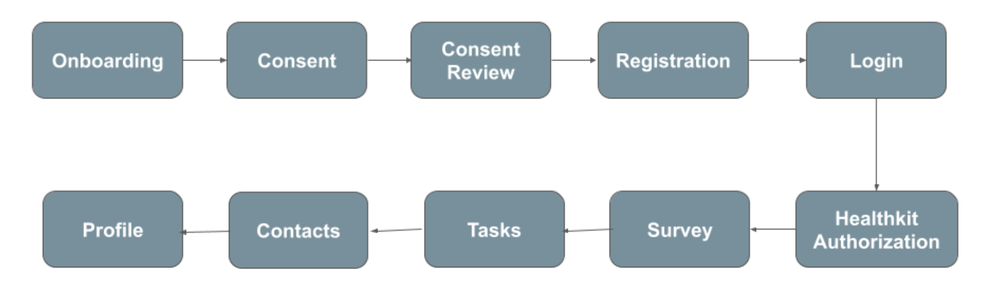</p>

## Onboarding

When a user launches an app for the first time, the onboarding process presents the app’s goals and provides instructions that highlight key benefits and features.

<p align="center">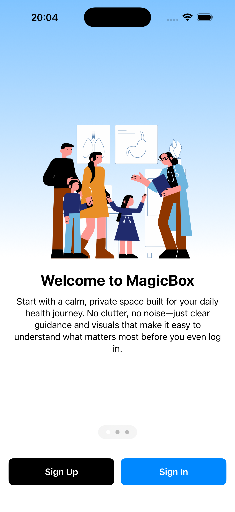</p>

## Consent

The informed consent is the process of a user granting authorization to an application to access specific resources on their behalf (for example, health sensors) and/or to perform certain actions (for example, as part of a medical study). Users will be asked for consent to allow access to their personal data.

<p align="center">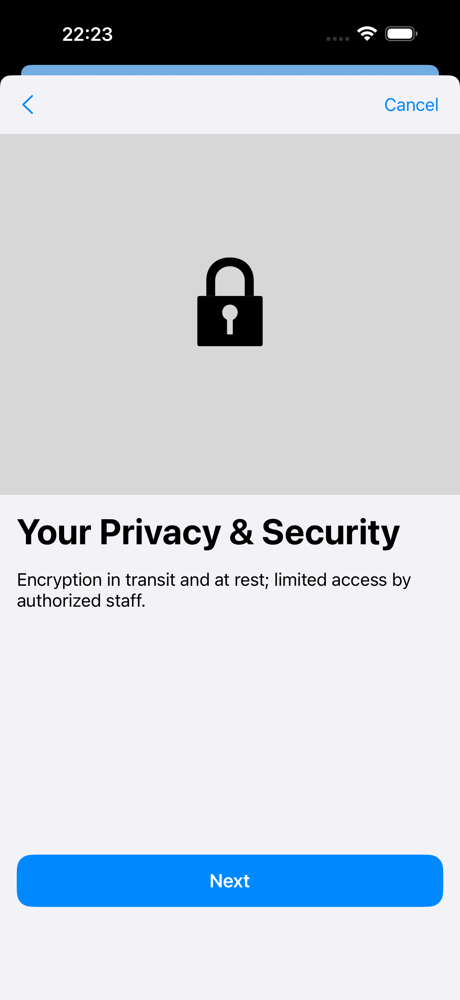</p>

## Consent Form and Signature

The consent form contains the description of the items included in the application that require explicit user consent. The user can agree to the clauses by signing the form.

<p align="center">
  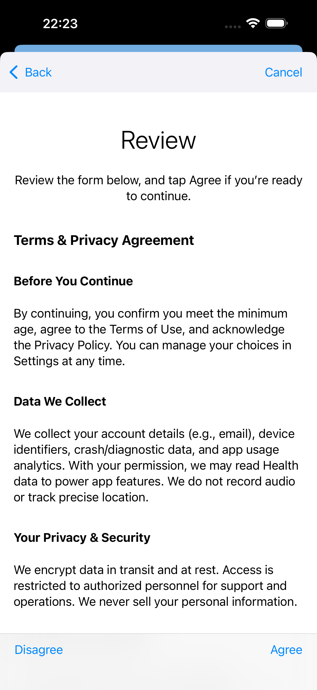
  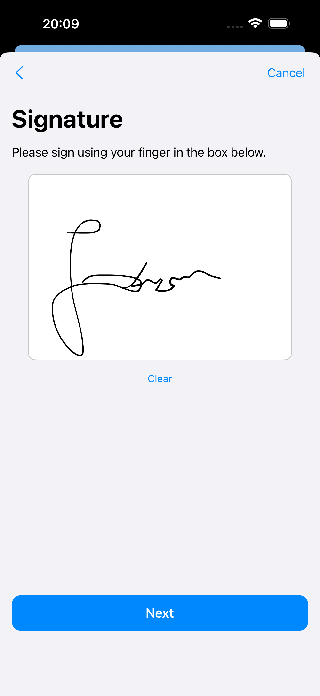
</p>

## Add consent document page in profile section
In MagicBox user can now see their consent form in their profile screen by clicking on the Consent documents section. 

<p align="center">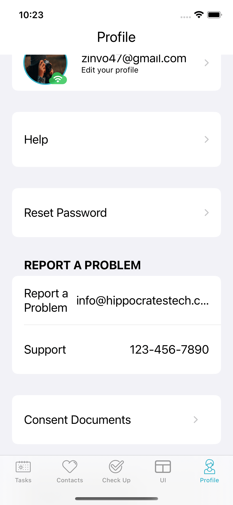</p>

## Simplified Registration and Login Process

The app includes screens to get a user to sign up to use a medical intervention, telemedicine account or research project. The registration page of the application asks for basic user details such as email, password, first name, last name, date of birth and gender, etc. For example, date of birth can be used for a minimum age eligibility check to limit the use of the app.

<p align="center">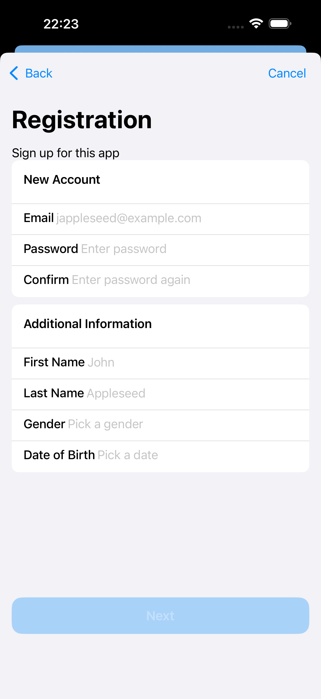</p>

## Regular Login/Social Login

MagicBox supports different login strategies: regular login using registration details, Sign in with Apple and Sign in with Google.

User login credentials are securely stored in the device’s keychain.

<p align="center">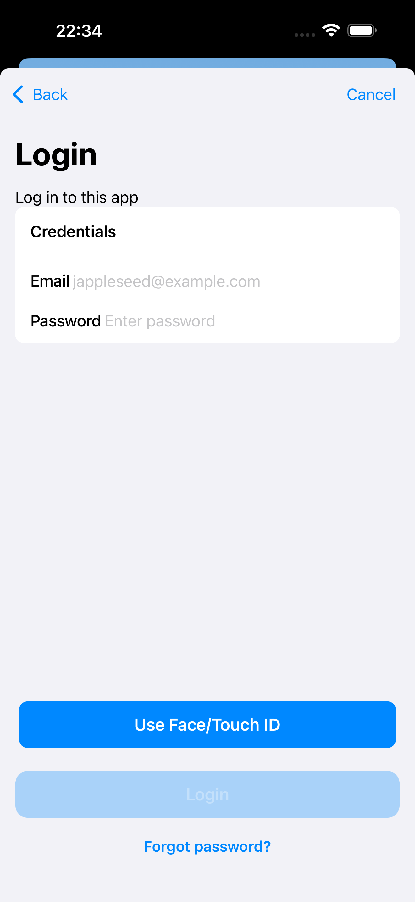</p>

To enable Google login, add your `GIDClientID` into the `Info.plist` file.

<p align="center">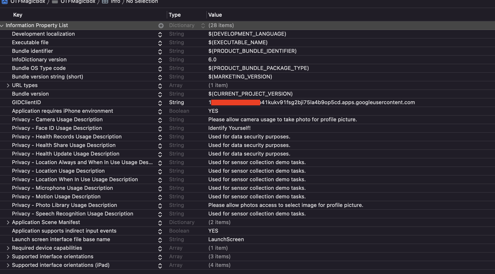</p>


## Biometric authentications
The App support Biometric authentication. A secure and user-friendly way to authenticate users in iOS applications with the introduction of Face ID and Touch ID.

User can authenticate by using their Face ID or Touch ID.

<p align="center">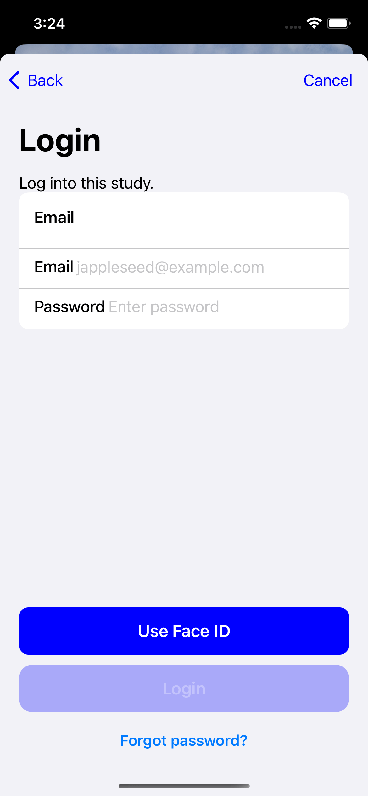</p>

## Password-less Login, Autofill Sign in
MagicBox includes AutoFill feature. With just a few taps, users can create and save new passwords or log in to an existing account. Users don’t need to enter their password, the system handles everything. It also encourages user to select strong passwords hence making user account more secure.

<p align="center">
  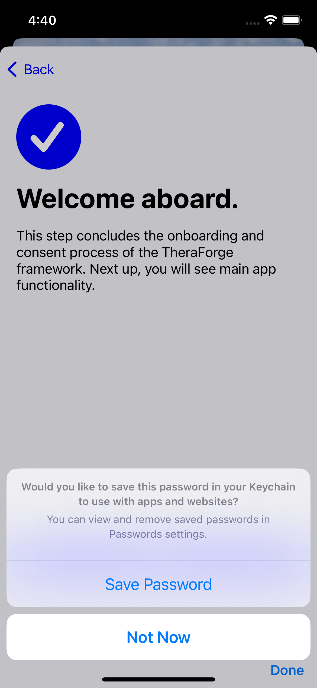
  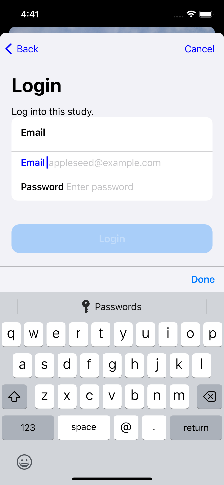
</p>

## Passcode

In order to protect access, the app can optionally require a four- or six-digit user-selected passcode.

<p align="center">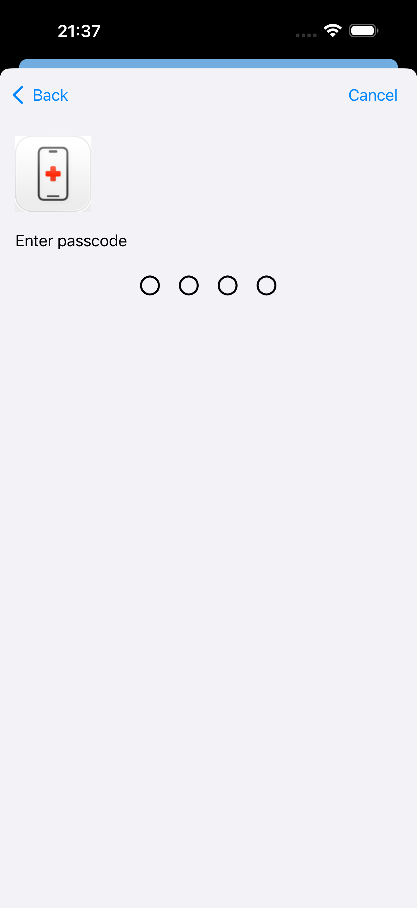</p>

## Activity

There are a number of pre-defined task types that you can include in your project: for example, a two finger tap test, the 6 minute walk test, a special memory test and a short walk test to measure gait and balance. These tasks include the instructions for the steps to perform to complete them.

<p align="center">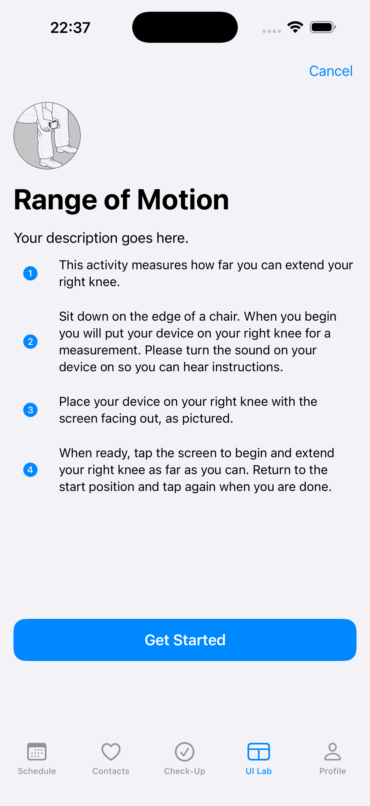</p>

## Surveys

A survey is a sequence of questions that you use to collect data from the users. Each step addresses a specific question in the survey, such as “What medications are you taking?” or “How many hours did you sleep last night?”. You can collect results for the individual steps or for the task as a whole.

<p align="center">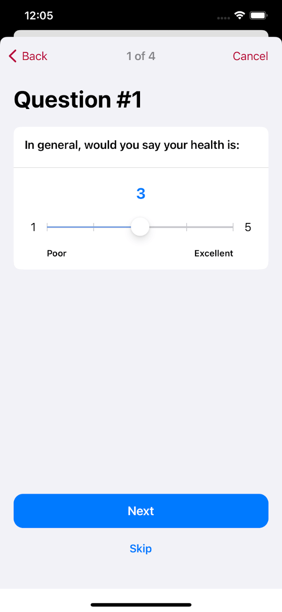</p>

## Contacts

Contacts are cards that contain doctor and family member details, such as address, phone number, messaging number, email address, etc.

<p align="center">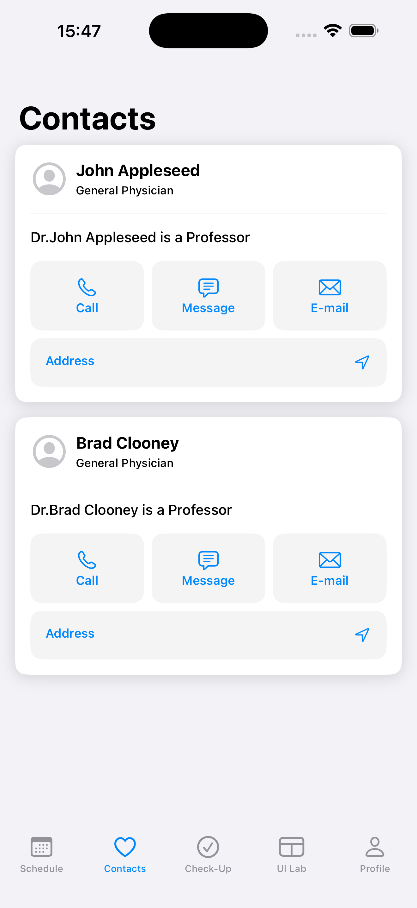</p>

## End-to-end File Encryption (TheraForge CryptoBox)
MagicBox includes end-to-end encryption on document sending and receiving by the user. It provides secure storage and additional security for communication that prevents third parties from accessing confidential data.

Encrypted files can only be decrypted by the intended receiver(s).

## User Profile

In the profile section, users can manage their current session, edit their profile, contact support, view the app diagnostics, and withdraw from a study.

<p align="center">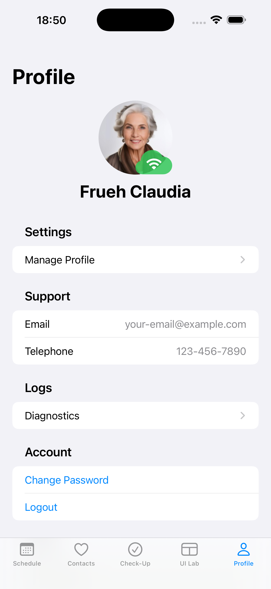</p>

The profile photo also includes a network status indicator, showing whether the app is currently connected to the TheraForge CloudBox service and whether the connection is over cellular or Wi‑Fi.

## Diagnostics

In Diagnostics, users can review and export the app’s diagnostic logs to support troubleshooting and customer-support requests.

Key features include:

- An in-app log viewer for inspecting detailed logs.

<p align="center">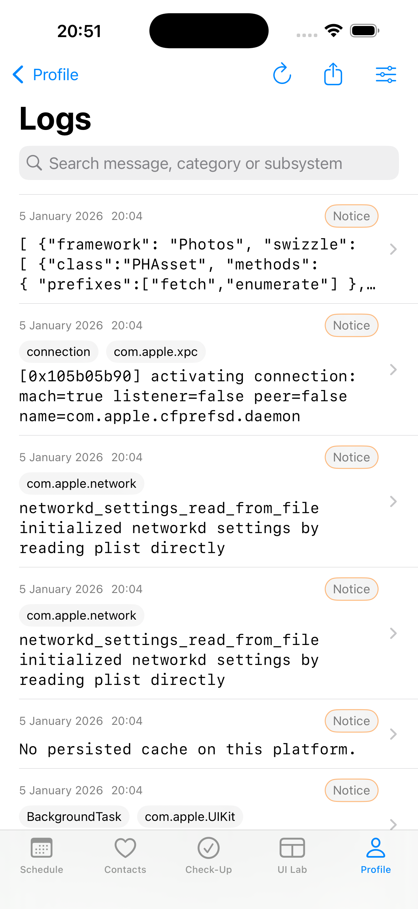</p>

- Export and share recent logs (default: last 24 hours; configurable) via email or messaging.

<p align="center">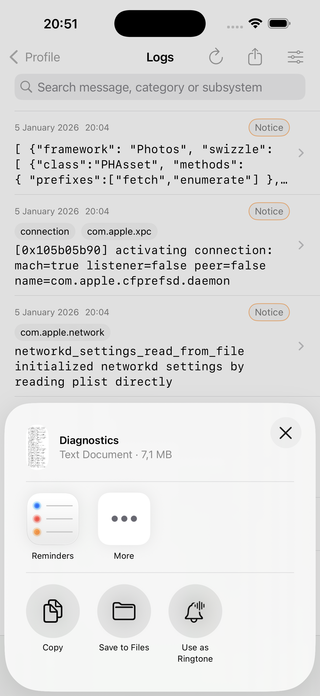</p>

- Filter logs by type and date (requires iOS 17 or newer).

<p align="center">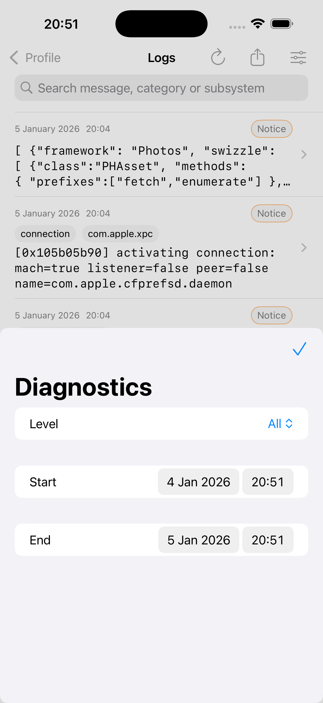</p>

- The default export range and most Diagnostics/Logs UI copy can be customized in `OTFMagicBox/Features/Logger/Models/LogConfiguration.yml` (e.g. `defaultDaysBack`).
- Sensitive values in logs are masked by default to help protect user privacy.

## TheraForge Secure Cloud with Sync Support

MagicBox can connect to the TheraForge Cloud service to enable offline-first, cross-device synchronization.

The GIF below demonstrates cross-device synchronization: an image update on one device is automatically propagated to another.

<p align="center">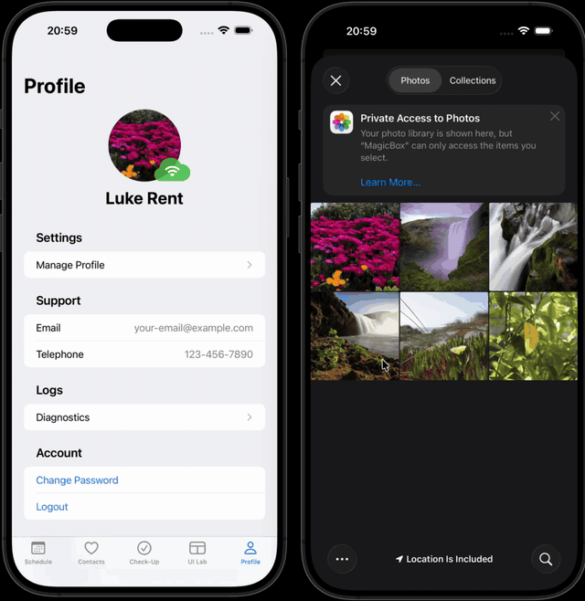</p>

The next GIF shows a task outcome (for example, a medication administration) being recorded and then synchronized to other devices:

<p align="center">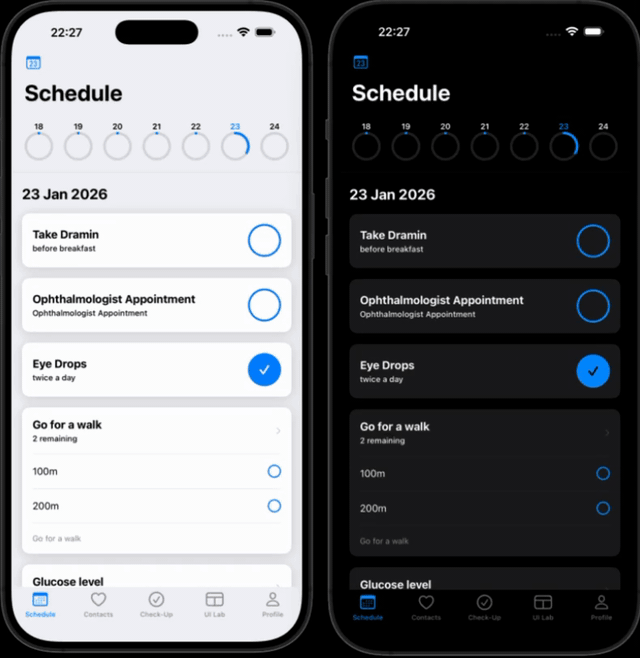</p>

## Accessibility

MagicBox app is designed to be compatible with the iOS accessibility features, ensuring that users with disabilities can access and use the app effectively. The app incorporates various accessibility features provided by iOS:

- Voice Over
- Voice Control
- Bold Text
- Dynamic Type
- High Contrast
- Color Invert
- Differentiate Without Color

## Apple Watch App

The MagicBox watchOS app is a companion to the iOS app, providing a glanceable view of today’s tasks and their status on Apple Watch. Updates are synchronized across devices, as shown below:

<p align="center">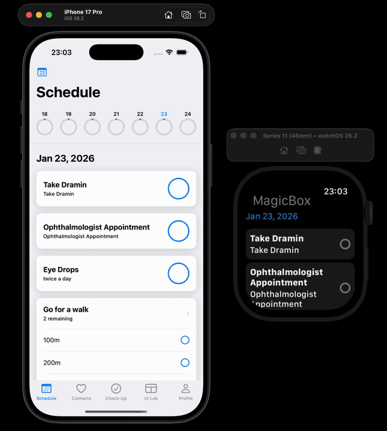</p>

To get started with the MagicBox watchOS app:

1. Ensure you have the MagicBox app installed on your iPhone.
2. Pair your Apple Watch with your device, if you haven't already.
3. Run the `OTFMagicBox Watch App` target from Xcode.

The app leverages [OTFCareKit](https://github.com/TheraForge/OTFCareKit) to fetch and display a list of tasks for the current day in a watch-friendly UI.

### Watch Synchronisation
Syncs daily tasks from iOS to watchOS and updates their outcomes in both stores.
 
```swift 
 // .mobile: synchronise watchOS store from IOS app
 // .watchOS: fetch IOS app store from watchOS
 // .watchAppUpdate: notify other device about data update

 CloudantSyncManager.shared.cloudantStore?.synchronize(target: .mobile, completion: { error in
      if let error = error {
             print(error)
        } else {
             OTFLog("Synced successfully!")
          }
    })
```

## Assets

MagicBox includes a variety of assets, such as illustrations, icons, and glyphs. You can preview all the available assets on our [asset gallery](https://tfmart.github.io/OTFMagicBox/).

You can also check the available assets locally by opening Terminal in the project directory and running:

```bash
./SampleImagesPreview.sh
```

To review and use images:
1. Locate **`Samples.xcassets`** in Xcode's sidebar (this folder contains all the template assets).
2. Select the asset you want to use.
3. Copy the asset (Cmd+C) and paste it (Cmd+V) into **`Assets.xcassets`**.
4. Use the image name in your code (e.g., `Image("doctor4")`) or in your YAML configuration.

<p align="center">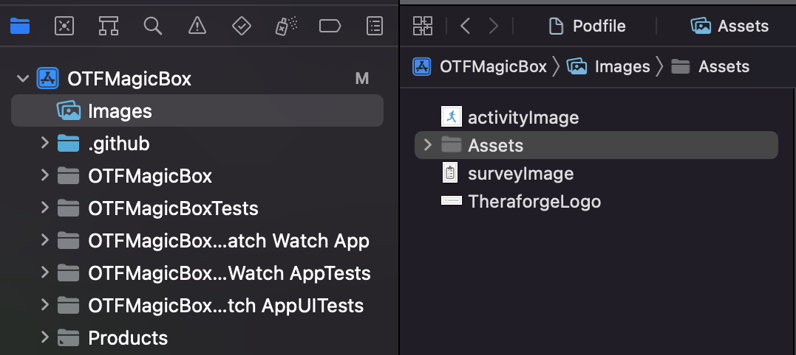</p>

# Easy Installation (Recommended)

Let’s get MagicBox up and running on your machine. The easiest way is to use the **MagicBox Installer script**.

**Prerequisites**: [Xcode](https://developer.apple.com/xcode/) 16 or later.

1. **[📦 Download the MagicBoxInstaller.zip](Docs/MagicBoxInstaller.zip)**
2. Unzip the folder.
3. Right-click the folder -> **“New Terminal at Folder”**.
4. Run:
   ```bash
   bash install_magicbox.sh
   ```

<p align="center">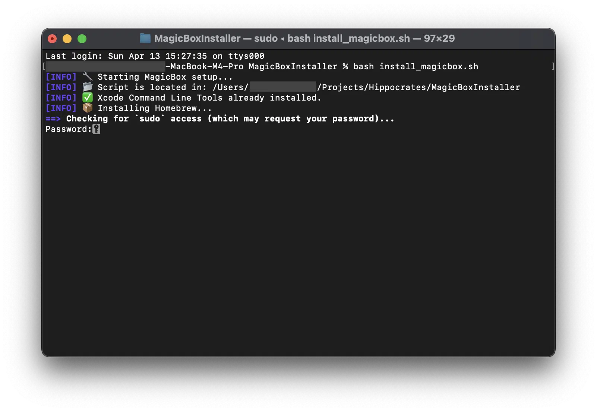</p> 

Once setup is complete, your project opens automatically in Xcode.

# Manual Installation

If you prefer to set up your environment manually (or encounter issues with the installer script), follow these steps to get ready for development.

## 1. Install Prerequisites

Before you begin, ensure you have the necessary tools installed on your Mac.

###  Xcode
download **Xcode 16+** from the [Mac App Store](https://apps.apple.com/us/app/xcode/id497799835).
> **Note**: Confirm you are running macOS 14 (Sonoma) or later.

###  Homebrew
Homebrew is a package manager that simplifies installing software. Open **Terminal** and run:

```bash
/bin/bash -c "$(curl -fsSL https://raw.githubusercontent.com/Homebrew/install/HEAD/install.sh)"
```

###  CocoaPods
CocoaPods manages the libraries (like the TheraForge SDK) used by MagicBox.

1. Install `git-lfs` (required for large files):
   ```bash
   brew install git-lfs
   ```

2. Install CocoaPods:
   ```bash
   sudo gem install cocoapods
   ```

---

## 2. Set Up the App

Now that your tools are ready, let's download the code.

1. **Clone the repository**:
   ```bash
   git clone https://github.com/TheraForge/OTFMagicBox.git
   cd OTFMagicBox
   ```

2. **Install Dependencies**:
   This step downloads all the required frameworks.
   ```bash
   pod install
   ```
   > *This may take a few minutes the first time.*

3. **Open the Project**:
   **Important**: Always open the white `.xcworkspace` file, not the blue `.xcodeproj`.
   ```bash
   open OTFMagicBox.xcworkspace
   ```

## 3. Compile & Run

1. Select a simulator (e.g., iPhone 16) from the top bar in Xcode.
2. Press the **Play** button (or `Cmd + R`) to build and run the app.

# Configuration and Usage

MagicBox uses a **Modular YAML Configuration** system. You don’t need to be a developer to edit these files and customize the application—use a common editor (e.g., TextEdit or Xcode) and follow the inline comments in each file.

## 1. Global App Settings

**File**: `OTFMagicBox/App/Models/AppConfiguration.yml`

This file controls app-wide settings, feature flags, and API keys.

### Set up the TheraForge Cloud API Key
To connect the app to the backend, you must provide a valid API Key from the TheraForge Cloud.
1. Open `AppConfiguration.yml`.
2. Locate the `apiKey` field.
3. Paste your key:
   ```yml
   apiKey: "your.production.api.key"
   ```

### Enable CareKit
To enable the CareKit integration (Schedule and Contacts tabs):
```yml
useCareKit: true
```
If set to `false`, the Schedule and Contacts tabs will be hidden.

## 2. App Styling & Default Theme

The appearance of the app is determined by `OTFMagicBox/App/Models/StyleConfiguration.yml`.

### Default Theme
To change the active theme used by the app, update `selectedStyle`:

```yml
selectedStyle: "customStyle"
```

### Creating a New Style
To create a new style, add an entry under `styles` with a unique name.

> **Design Tip**: When creating a new style, refer to Apple's [Human Interface Guidelines](https://developer.apple.com/design/human-interface-guidelines) for best practices and [SF Symbols](https://developer.apple.com/sf-symbols/) for iconography.

```yml
styles:
  - name: "myBrandStyle"
    tintColor: "systemBlue"
    fontName: "Avenir"
    # ...
```

### Best Practices

#### 🎨 Semantic Colors
Prefer **System Colors** (e.g., `systemBlue`, `systemGreen`) and **Semantic UI Colors** (e.g., `label`, `systemBackground`) over fixed hex codes.
- **Adaptability**: They automatically adjust for **Light and Dark Mode**.
- **Consistency**: They ensure your app looks at home on iOS.
- [View Apple's System Colors Guidelines](https://developer.apple.com/design/human-interface-guidelines/color#System-colors)

#### 📝 Semantic Typography
Use **Dynamic Type** text styles (e.g., `headline`, `body`, `footnote`) instead of fixed font sizes.
- **Accessibility**: Respects the user's system-wide text size preference.
- **Hierarchy**: Automatically provides appropriate weights and leading.
- [View Apple's Typography Guidelines](https://developer.apple.com/design/human-interface-guidelines/typography#Dynamic-Type-sizes)

## 3. Customize Onboarding

**File**: `OTFMagicBox/Features/Onboarding/Models/OnboardingConfiguration.yml`

You can customize the welcome screens presented to new users. Define pages in the `pages` list:

```yml
pages:
  - backgroundColor: "blue"
    illustration: "illustration_welcome"
    title:
      en: "Welcome to MagicBox"
      pt: "Bem-vindo ao MagicBox"
    subtitle:
      en: "Start your health journey..."
      pt: "Comece sua jornada..."
```

## 4. Customize Authentication & Legal

**File**: `OTFMagicBox/Features/Authentication/Models/AuthConfiguration.yml`

This file controls the Sign Up, Sign In, and Consent flows.

### Customize Consent and Terms
You can explicitly define the sections of your content document.
```yml
consentSections:
  - type: "overview"
    show: true
    title:
      en: "Before You Continue"
    summary:
      en: "Review our terms..."
```
Set `showPrivacyAndTerms: true` in `AppConfiguration.yml` to display these in the Profile tab as well.

### Customize Registration and Login
Toggle available login methods and registration fields:

```yml
# Include extra fields
includeDOB: true
includeGender: true

# Enable Social Login
showAppleLogin: true
showGoogleLogin: true
```

### Configure the Passcode
To require a passcode (PIN) for accessing the app:
```yml
passcodeEnabled: true
passcodeType: "4" # "4" or "6" digits
```

## 5. Feature Configurations

- **Profile**: `OTFMagicBox/Features/Profile/Models/ProfileConfiguration.yml`
- **Schedule**: `OTFMagicBox/Features/Schedule/Models/ScheduleConfiguration.yml`
- **Contacts**: `OTFMagicBox/Features/Contacts/Models/ContactsConfiguration.yml`
- **Check-Up**: `OTFMagicBox/Features/CheckUp/Models/CheckUpConfiguration.yml`
- **Diagnostics**: `OTFMagicBox/Features/Logger/Models/LogConfiguration.yml`

## 6. App Localization

MagicBox supports **English (EN)**, **Portuguese (PT)**, and **Arabic (AR)**. Localization is handled directly within each feature's YAML configuration file, making it easy to support new languages without changing code.

### How to Localize Content
Each user-visible string in the configuration files is a dictionary of language codes. To add or update a translation, simply add the corresponding key:

```yaml
title:
  en: "Daily Check-Up"
  pt: "Check-up Diário"
  ar: "الفحص اليومي"
```

### Right-to-Left (RTL) Support
The app automatically handles **RTL (Right-to-Left)** layout when the system language is set to Arabic. This ensures that the UI components, text alignment, and navigation flows are correctly mirrored for an optimal user experience.

<p align="center">
  
</p>

### Adding More Languages
1. Open the relevant YAML configuration file.
2. Add the new language code (e.g., `es` for Spanish, `fr` for French) to all localized string dictionaries.
3. Ensure the language is added to the supported languages in the Xcode project settings if required for system-level localization.

## Change the App's Name

To rename the app:

1. Select the project root in Xcode.

   <p align="center">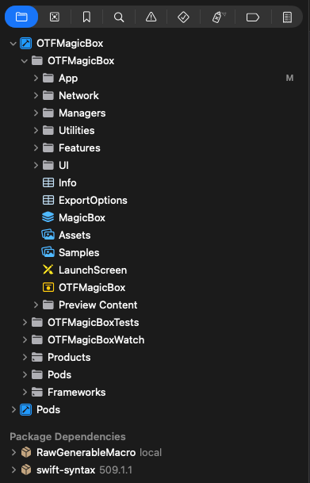</p>

2. Open `Info.plist` and find the **Bundle name** key.
3. Change its value to your desired name (e.g., from `$(PRODUCT_NAME)` to "My Digital App").

   <p align="center">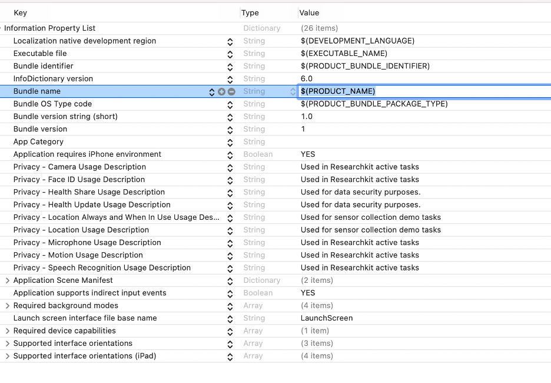</p>

# Architecture

MagicBox follows a modular **MVVM (Model-View-ViewModel)** architecture, ensuring separation of concerns and testability.

### MVVM Pattern
- **Models**: Plain Swift structs or Codable objects (often defined in YAML) that hold data.
- **Views**: SwiftUI views that display data and capture user interactions.
- **ViewModels**: `ObservableObject` classes that manage state, handle business logic, and communicate with the data layer.

### UserInfo & Data Management
User data is managed using **CareKit** entities (`OCKPatient`).
- **Storage**: Data is stored locally in an encrypted database and synced to the cloud via `CloudantSyncManager`.
- **Access**: The `ProfileViewModel` retrieves the current user (identified by email) from the `CareKitStoreManager`.
- **Security**: Sensitive fields are handled securely, and the app supports "Right to be Forgotten" via account deletion APIs.

# UI Lab and Snippets

MagicBox 2.0.0 introduces the **UI Lab**, a dedicated tab for exploring components and running snippet-based experiments.

- **Demos**: View working examples of ResearchKit tasks, CareKit components, and Charts.
- **Playground**: Configure the `playgroundMode` in `AppConfiguration.yml` to launch directly into a specific test view.

## Health Sensors (Remote Patient Monitoring)

The **Health Sensors** feature is an educational catalog of HealthKit sensor cards for Remote Patient Monitoring (RPM). It features a **Dashboard** that summarizes key metrics and individual cards that visualize detailed data and handle permissions.
Full documentation for Health Sensors can be found in [HEALTH-SENSORS.md](HEALTH-SENSORS.md).

Health Sensors also includes a lightweight **CareKit sensor task** flow: from **Schedule → Sensors**, users can add a sensor task by metric and send outcomes from the sensor cards.

- **Location**: UI Lab → CoreMotion → Health Sensors
- **Config**: YAML-driven strings and configuration
  - `OTFMagicBox/Features/UILab/HealthSensors/Models/HealthSensorsConfiguration.yml`
  - `OTFMagicBox/Features/Schedule/Models/SensorTaskConfiguration.yml` (sensor task labels/titles/instructions)
- **Dashboard**: Aggregates selected metrics (Heart Rate, Blood Pressure, etc.) into a single view.
- **Mock data**: Toggle via the gear icon in the **Dashboard** toolbar (simulator-friendly).
- **Live heart rate**: Watch-based streaming via WatchConnectivity (Apple Watch).
- **Schedule tasks**: Add example sensor tasks from the Schedule toolbar and submit outcomes from sensor cards.

## Xcode Snippets

A curated set of **ResearchKit-focused Xcode code snippets** is included under `Snippets/` to help you scaffold common **steps** and **answer formats** quickly (with inline placeholders you can fill in as you go).

**Contents**
- **Answer formats**: `Snippets/Answers/*` (e.g. boolean, scale, text choice).
- **Steps**: `Snippets/Steps/*` (e.g. question, form, instruction, completion).

**Install**

```bash
ruby Scripts/install_snippets.rb
```

Restart Xcode after installation.

**Notes**
- The installer copies snippets to `~/Library/Developer/Xcode/UserData/CodeSnippets/`.
- The installer generates new identifiers each time it runs; re-running it can create duplicate snippets in Xcode. If you need to reinstall, remove the previously installed snippets from Xcode’s Snippet Library (or delete the corresponding `.codesnippet` files in the folder above) before running the script again.


**Browse snippets (Library)**
1. Press `Cmd+Shift+L` to open Xcode’s Snippets Library.
2. Select **Code Snippets**.
3. Search for a snippet by name/prefix (for example `ork`).
4. Double-click (or drag and drop) to insert it into your Swift file.

<p align="center">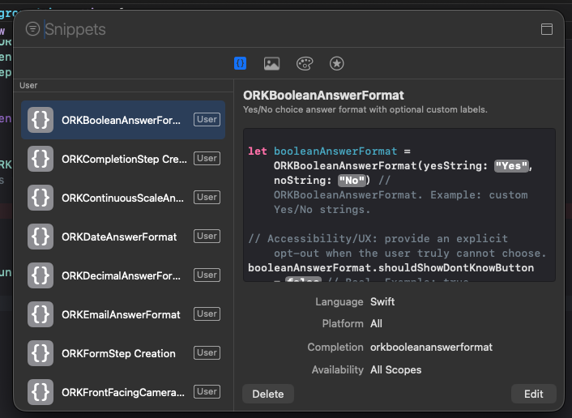</p>

**Using snippets via autocomplete**

You can also insert snippets directly from the editor using autocomplete. Start typing a snippet name/prefix (for example `orkquestionstep` or `orkbooleananswerformat`) and select it from the suggestions.
<p align="center">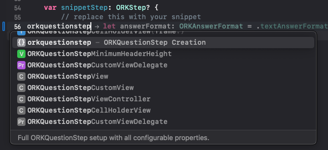</p>

After insertion, the snippet expands into a ready-to-edit scaffold. Use Tab / Shift + Tab to jump between placeholders and fill in the required values.

<p align="center">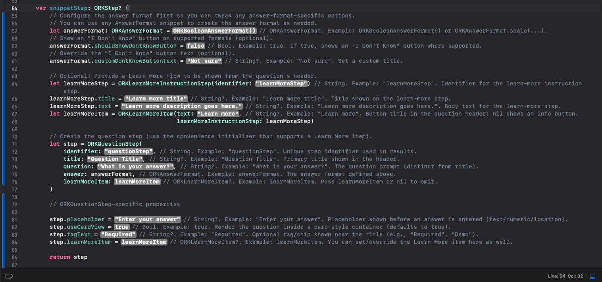</p>

# Development Setup

### Registration on Apple Developer Portal
To deploy the app to a device or the App Store, you must have an active Apple Developer account.

- [Apple Developer Program](https://developer.apple.com/programs/)
- [Certificates, Identifiers & Profiles](https://developer.apple.com/account/resources)
- [**Detailed App Registration Guide**](https://github.com/TheraForge/OTFMagicBox/blob/main/APP-REGISTRATION.md)

1. **Register User**: Add your Apple ID to Xcode (Settings > Accounts).
2. **Bundle ID**: Ensure the Bundle Identifier in `Signing & Capabilities` is unique to your team.
3. **Capabilities**: The following capabilities must be enabled:
   - HealthKit
   - Push Notifications (if using sync)
   - Sign In with Apple (if enabled in Auth config)

### Register a new API key

To connect the app to the TheraForge Cloud, you need an API Key. Use the [TheraForge Admin Console](https://stg.theraforge.org/admin/).

1. **Register Key**: Create a new API key for your project.

   <p align="center">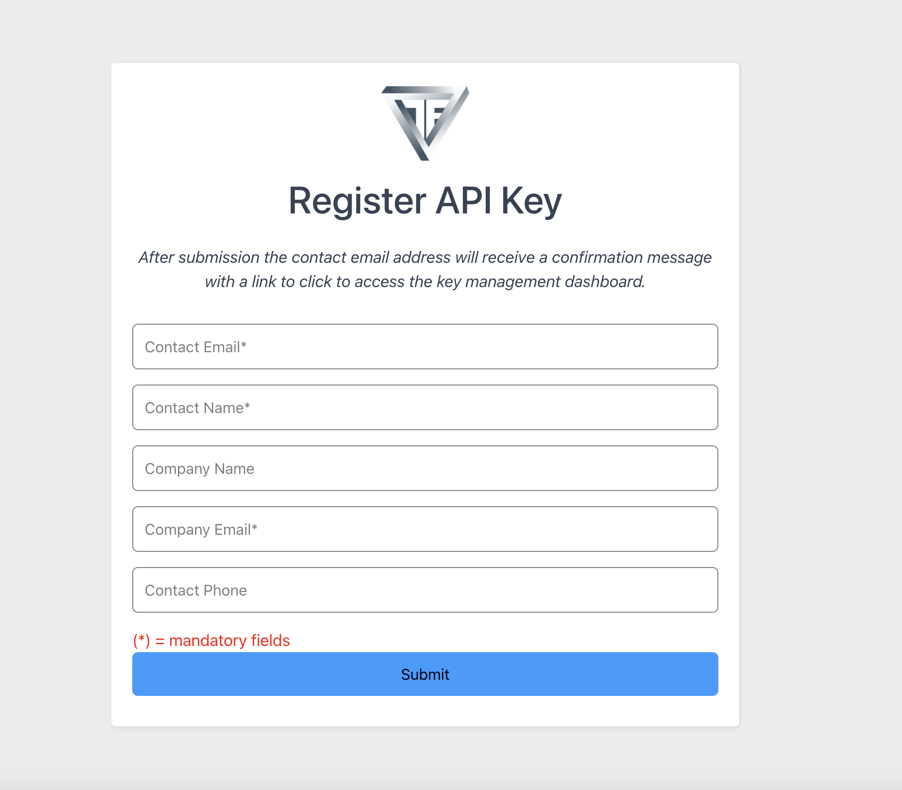</p>

2. **Copy Key**: Copy the generated key.

   <p align="center">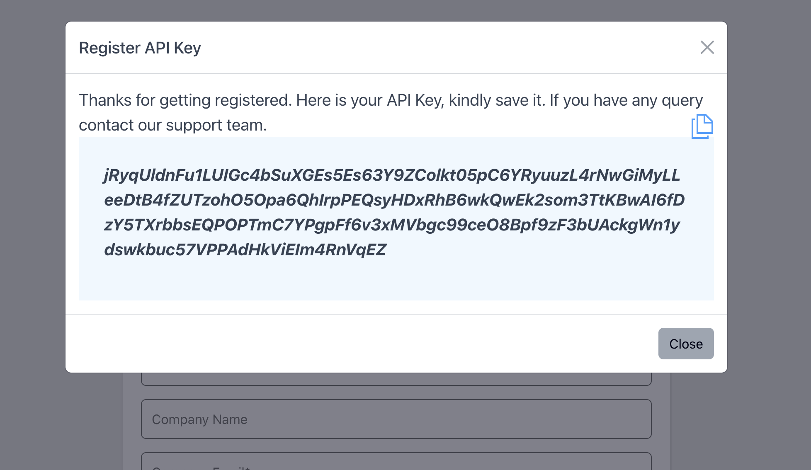</p>

3. **Log In**: Visit the [Login Page](https://stg.theraforge.org/admin/login).

   <p align="center">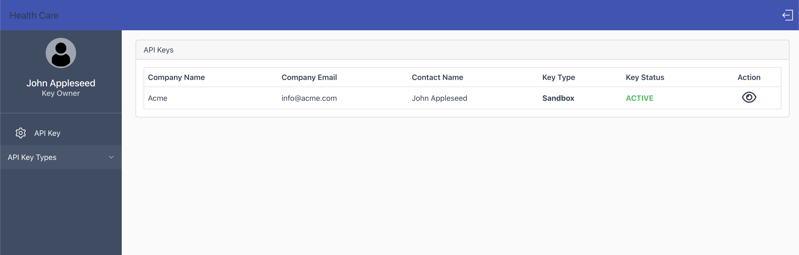</p>

4. **Paste in Config**: Open `OTFMagicBox/App/Models/AppConfiguration.yml` and paste the key into the `apiKey` field.

### CI/CD Setup
The project includes standard GitHub Actions workflows for Continuous Integration.
For detailed setup instructions, see the [CI/CD Guide](https://github.com/TheraForge/OTFMagicBox/blob/main/.github/CICD.md).

- **Workflows**: Located in `.github/workflows/`.
- **Features**: Automatically builds the app and runs unit tests on every Pull Request.
- **Customization**: Edit the YAML files in that directory to add deployment steps (e.g., TestFlight upload).

## License

This project is licensed under the **Hippocrates Technologies Commercial License**.
See the [LICENSE](https://github.com/TheraForge/OTFMagicBox/blob/main/LICENSE.md) file for details.
