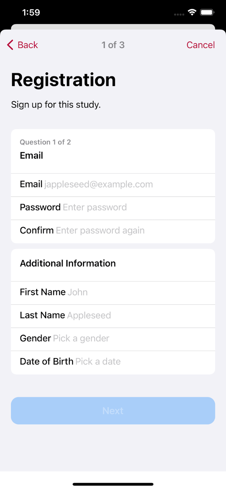
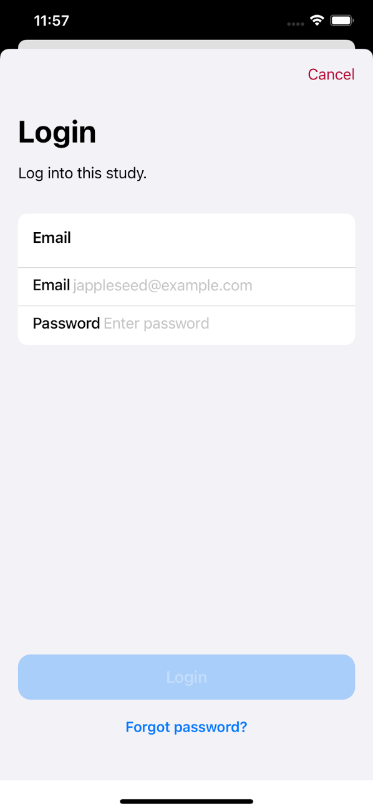
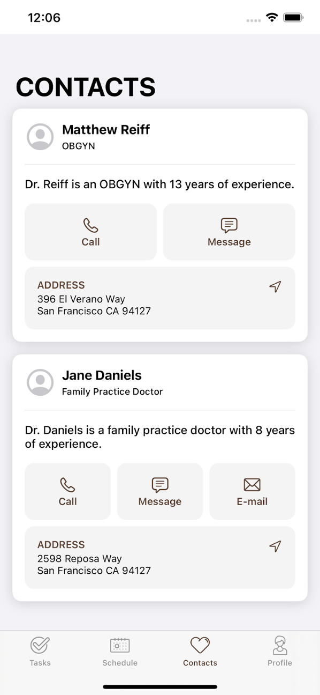
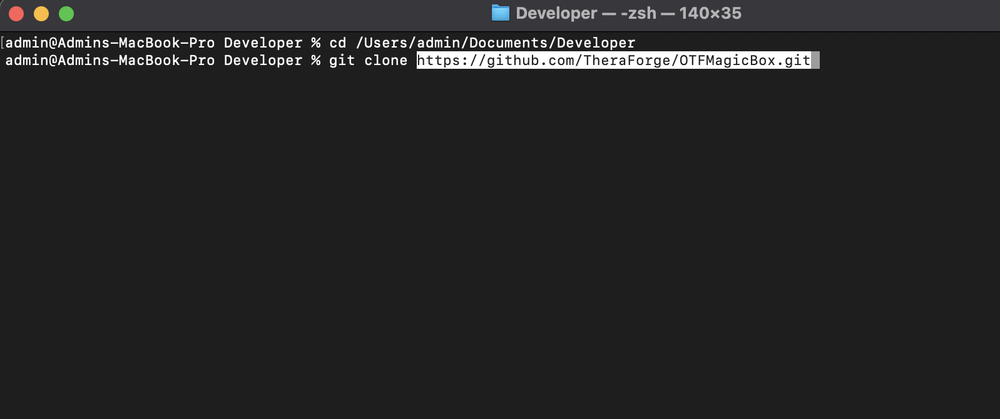
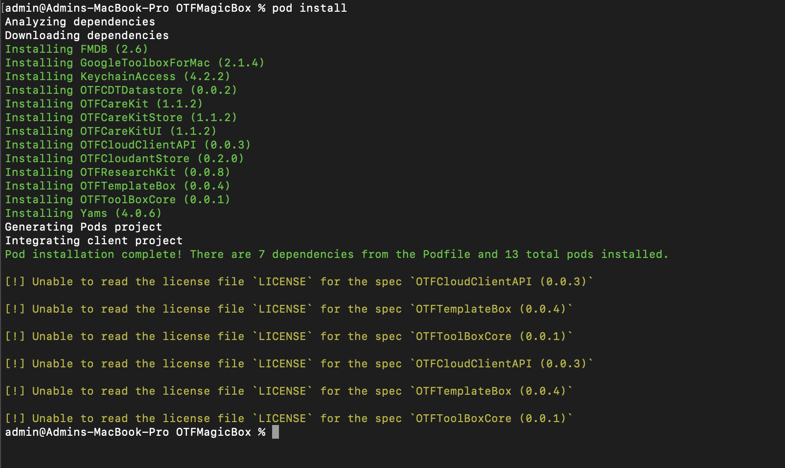
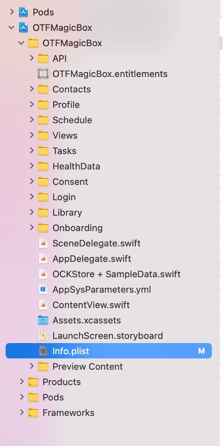

# TheraForge MagicBox 1.0.0-beta

The Open TheraForge (OTF) MagicBox app is a template for creating digital health solutions that help people better manage their health.

This sample application leverages TheraForge frameworks such as [OTFTemplateBox](../../../OTFTemplateBox) to implement a no-code solution that can be customized without requiring any code changes.

For more details on the composition of the SDK, refer to the [OTFToolBox](../../../OTFToolBox) Readme file.

# Table of Contents

* [Overview](#Overview)
* [Installation](#Installation)
* [Usage](#Usage)
* [License](#License)

# Overview 

MagicBox app’s source code represents an example of how to use the frameworks in the TheraForge SDK. It will constantly evolve to incorporate and showcase new features of the SDK.

You can use MagicBox as a reference, or you can fork it and make it the starting point for your own app. This open template can help you to create your own digital health application prototype in just a few minutes, without investing a lot of time and money, and even with limited knowledge of coding.

These are its primary characteristics:

* No-code configuration and setup for accelerated development.
* Informed consent process and survey generation using Apple's ResearchKit framework.
* Care plan management using Apple's Carekit framework.
* Monitoring of health data with Apple's HealthKit framework.
* Automatic data synchronization across the Cloud (a la Dropbox) using the OTFToolBox SDK.
* Support for various popular technologies out of the box: user authentication (Sign in with Apple in addition to standard login) with OAuth2, HIPAA- abd GDPR-compliant traffic encryption at rest and in transit (uses TLS 1.3 crypto), app notifications using HTTP 2 Server-Sent Events (SSE), etc.
* SF Symbols 1.1 support (available on iOS/iPadOS 13 and watchOS 6, and later releases)

MagicBox includes the following customizable features:

## Onboarding

When a user launches an app for the first time, the onboarding process presents the app’s goals and provides instructions that highlight key benefits and features.

## Consent

The informed consent is the process of a user granting authorization to an application to access specific resources on their behalf (for exammple, health sensors) and/or to perform certain actions (for example, as part of a medical study). Users will be asked for consent to allow access to their personal data.

## Consent Form and Signature

The consent form contains the description of the items included in the application that require explicit user consent. The user can agree to the clauses by signing the form.

## Simplified Registration and Login Process

The app includes screens to get a user to sign up to use a medical intervention, telemedicine account or research project. The registration page of the application asks for basic user details such as email, password, fullname, last name, date of birth and gender, etc. For example, date of birth can be used for a minimum age eligibility check to limit the use of the app.

## Login/Social Login

MagicBox supports different login strategies: regular login using registration details, Sign in with Apple and Sign in with Google.

User login credentials are securely stored in the device’s keychain.

## Passcode

In order to protect access, the app can optionally require a four- or six-digit user-selected passcode.

## Activity

There are a number of pre-defined task types that you can include in your project: for example, a two finger tap test, the 6 minute walk test, a special memory test and a short walk test to measure gait and balance. These tasks include the instructions for the steps to perform to complete them.

## Surveys

A survey is a sequence of questions that you use to collect data from the users. Each step addresses a specific question in the survey, such as “What medications are you taking?” or “How many hours did you sleep last night?”. You can collect results for the individual steps or for the task as a whole.

## Contacts

Contacts are cards that contain doctor and family member details, such as address, phone number, messaging number, email address, etc.

## User Profile

The profile section includes the user account view as well as additional information, actions and links such as help, report, customer support address, withdrawal from study, and logout.

# Installation 

1. ### Create Developer Folder
Create a new folder in your `Documents` folder (you may choose another location) and name it as `Developer`. Then open terminal application and change your directory to this newly created `Developer` folder.

2. ### Copy Repo URL
Copy the URL of the repo to clone it. Remember to select HTTPS from the options (as highlighted in red in the image) and copy the repo URL.

3. ### Clone the Repo
Go back to the terminal and enter `git clone` followed by the repo URL you just copied in the previous step.

4. ### List the Files
Now run the `ls` command in the terminal to see the files in the directory cloned from the repo.

Note the Podfile there in the list of files.

5. ### Pod Install
Run `pod install` command to install the dependencies. You should see something as shown in the image below when you run this command.

6. ### List the Files Again
Now list the files again using `ls` command in the terminal. This time you'll see two extra files in the list as highlighted in the image.

7. ### Open Workspace
`OTFMagicBox.xcworkspace` is the file we shall use from now onwards. To open this project in Xcode we may either double click on this file or open it using `open OTFMaicBox.xcworkspace` in the terminal.

When this project opens in Xcode you should see something like this.

# Usage 

After following the installation steps, go to the `AppSysParameters.yml` file in the root folder of your project. This yaml file contains a list of customizable parameters of your health application.
You don’t need to be a developer to edit this file and customize the application, just use a common editor (e.g., TextEdit or Xcode) and follow the simple instructions present in the `AppSysParameters.yml` file.
By editing this yaml file you can customize the health application according to your requirements, for example you can modify the app styling and flow.

Review the complete yaml file to learn about the available settings (also called *key-value pairs*) and edit the values of the keys according to your application's requirements, which will allow you to customize your digital health application in just a few minutes.

## Change the App's Name

You can modify the app's name by following the instructions given below.

Go to the root of your project in Xcode (sidebar shown in the figure below).

Click on the `Info.plist` file. Xcode will show the contents of the `Info.plist` file as a list of settings (key-value pairs). Go to the row with the key named “Bundle name”. Click on the Value column of that row and change the value to your application name, as shown in the figure below.

Example: change $(PRODUCT_NAME) to “My Digital App”.  

## Modify the Style/Design

You can change the tint color, the label colors, font type and size to customize the look of your application. 

[Color Codes in designConfig Section](/OTFMagicBox/AppSysParameters.yml#L83-L177)

## Set up the Cloud's API Key

Update the API key to access the TheraForge Secure Cloud.

[API Key Configuration Section](/OTFMagicBox/AppSysParameters.yml#L194-L195)

## Customize Onboarding

To customize the onboarding process, go to the onboarding section in the `AppSysParameters.yml` file and add as many onboarding pages as you need. You can add the image types of your choice such as Emoji, SF Symbols and assets. In the description you can write the text explaining each particular onboarding page.

[Onbarding Configuration Section](/OTFMagicBox/AppSysParameters.yml#L220-L228)

## Customize Consent

To customize the Consent process of your application go to the Consent section in the `AppSysParameters.yml` file and add/modify the required sections. Follow the instructions given in the yaml file to add the correct type of consent sections.

[Consent Configuration Section](/OTFMagicBox/AppSysParameters.yml#L230-L286)

## Customize Registration and Login

Go to the Registration section in the `AppSysParameters.yml` file and change the settings for *Date Of Birth* and *Gender* to `true` if you want to display those fields in your Registration form, otherwise set them to `false`.

[Registration Configuration Section](/OTFMagicBox/AppSysParameters.yml#L288-L293)

## Configure Regular Login/Social Login

Go to the Login section in the `AppSysParameters.yml` file and customize the title and the description.

If you want to use the *Sign up With Apple* feature, then change the corresponding setting to `true`.

[Login Configuration Section](/OTFMagicBox/AppSysParameters.yml#L295-L306)

## Configure the Passcode

Go to the Passcode section in the `AppSysParameters.yml` file and change the settings of passcode text and passcode type to 4 or 6 digits.

[Passcode Configuration Section](/OTFMagicBox/AppSysParameters.yml#L308-L316)

## Enable CareKit

If your application requires support for tasks (for example, for a care plan) and contacts, then enable the `useCareKit` key, which allows you to display the contacts and list the tasks of the patients.

[Carekit Configuration Section](/OTFMagicBox/AppSysParameters.yml#L327-L330)

# License 

Todo: Add License
