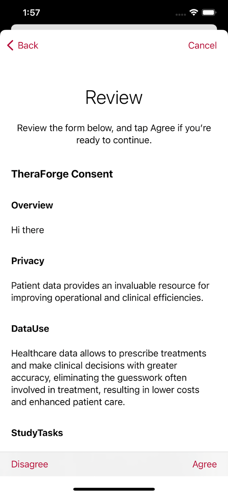
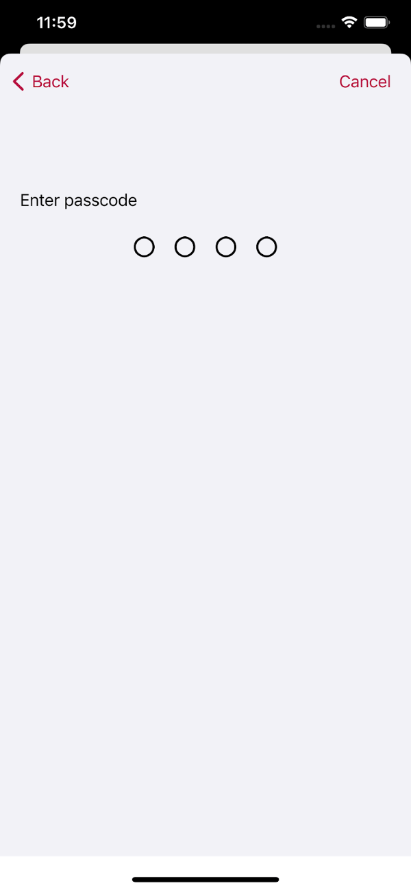
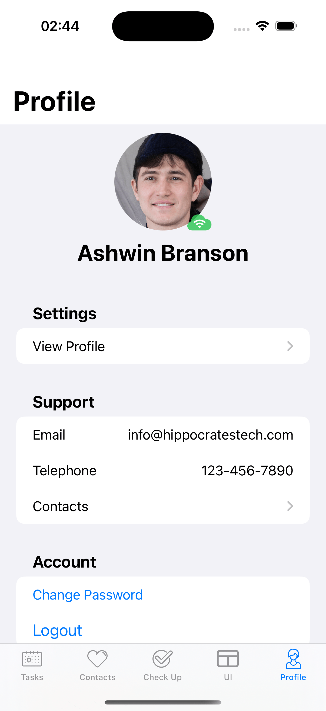
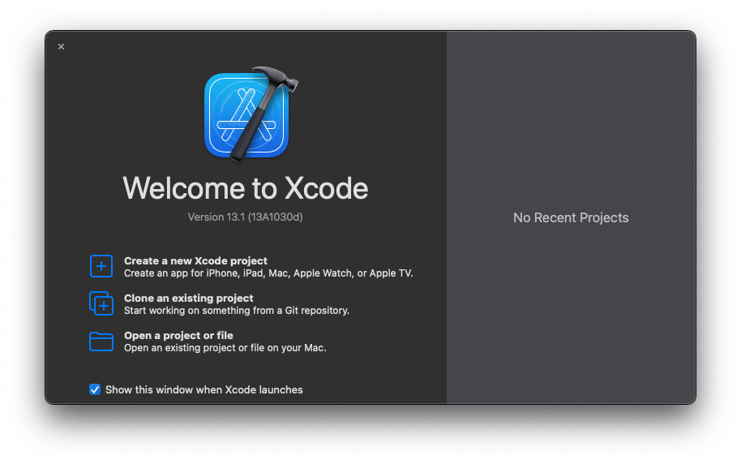

# TheraForge MagicBox

The Open TheraForge (OTF) MagicBox app is a template for creating digital health solutions that help people better manage their health.

This sample application leverages TheraForge frameworks such as [OTFTemplateBox](../../../OTFTemplateBox) to implement a no-code solution that can be customized without requiring any code changes.

For more details on the features of the SDK and on the TheraForge Cloud setup process (e.g., to obtain an API key), refer to the [OTFToolBox](../../../OTFToolBox) Readme file.

## Change Log
<details open>
  <summary>Release 1.0.3-beta</summary>
  
  - **End-to-End File Encrption (TheraForge CryptoBox)**
    Added end-to-end encrption feature which prevents third parties from accessing data while it's being transferred from one user to another
  - **Biometric authentications**
    The app supports biometric authentication which provides secure and user-friendly way to authenticate users
  - **Password-less login, use auto-fill sign in**
    With just a few taps, users can create and save new passwords or log in to an existing account
  - **Manage documents**
    MagicBox allows you to upload, donwload, re-name and delete different docuements. User's profile picture and consent form are saved as documents.
  - **Improved theme customization using yml file**
    - Font
    - Font size
    - Font weight
    - Background color
    - Foreground color
  - **Apple Watch Demo App**
    - Added a companion WatchOS app for MagicBox
    - Allow users to check and manage tasks for the current day from their Apple Watch
  - **Enhanced styling of the Profile screen**
  - **New network indicator**
    - Implemented a networking indicator to provide a visual representation of the connection status to TheraForge CloudBox servers
  - **New Consent documents layout section in Profile screen**
  - **Accessibility Enhancements**
    - Enhanced VoiceOver support for the Bold Text and Invert Colors system options for enhanced accessibility
    - Added support for Bold Text and Invert Colors for enhanced accessibility options
  - **Design and Assets**
    - Incorporated new assets, including more than 360 images and dozens of additional icons/SF Symbols, ready to be used inside the iOS app
  - **Compatibility Updates**
    - Increased the iOS target version to iOS 14.5 for broader device compatibility and feature support
</details>

<details>
    <summary>Release 1.0.2-beta</summary>
    <ul>
        <li>Made the application more configurable by adding color, font, font weight, background color in the yaml file.</li>
        <li>Added app localization capabilities in the yaml file.</li>
        <li>Consolidated multiple yaml files into two.</li>
        <li>Added support for user account deletion to make the app more GDPR compliant.</li>
        <li>Added CI/CD workflow to automate testing and deployment in TestFlight using GitHub Actions. Updated documentation with the required configuration steps.</li>
        <li>Various fixes and improvements.</li>
    </ul>
</details>

<details>
  <summary>Release 1.0.1-beta</summary>
  Removed warnings, improved profile section, added UI samples and made various other improvements
  
</details>

<details>
  <summary>Release 1.0.0-beta</summary>
  First beta release of the template app
</details>

# Table of Contents

* [Overview](#overview)
* [Features](#magicbox-features)
* [Installation](#magicbox-installation)
* [Usage](#app-usage)
* [Registration on Apple Developer Portal](#registration-on-apple-developer-portal)
* [Register a new API key](#register-a-new-api-key)
* [Xcode Setup](#xcode-setup)
* [CI/CD Setup](#cicd-setup)
* [License](#license)

# Overview

MagicBox app’s source code represents an example of how to use the frameworks in the TheraForge SDK. It will constantly evolve to incorporate and showcase new features of the SDK.

You can use MagicBox as a reference, or you can fork it and make it the starting point for your own app. This open template can help you to create your own digital health application prototype in just a few minutes, without investing a lot of time and money, and even with limited knowledge of coding.

These are its primary characteristics:

* No-code configuration and setup for accelerated development.
* Informed consent process and survey generation using Apple's ResearchKit framework.
* Care plan management using Apple's Carekit framework.
* Monitoring of health data with Apple's HealthKit framework.
* Automatic data synchronization across the Cloud (a la Dropbox) using the OTFToolBox SDK.
* Support for various popular technologies out of the box: user authentication (Sign in with Apple in addition to standard login) with OAuth2, HIPAA- abd GDPR-compliant traffic encryption at rest and in transit (uses TLS 1.3 crypto), app notifications using HTTP 2 Server-Sent Events (SSE), etc.
* SF Symbols 1.1 support (available on iOS/iPadOS 13 and watchOS 6, and later releases).
* CI/CD support via GitHub Actions.


# MagicBox Features

MagicBox includes the following customizable features:

<p align="center"></p>

## Onboarding

When a user launches an app for the first time, the onboarding process presents the app’s goals and provides instructions that highlight key benefits and features.

<p align="center"></p>

## Consent

The informed consent is the process of a user granting authorization to an application to access specific resources on their behalf (for exammple, health sensors) and/or to perform certain actions (for example, as part of a medical study). Users will be asked for consent to allow access to their personal data.

<p align="center"></p>

## Consent Form and Signature

The consent form contains the description of the items included in the application that require explicit user consent. The user can agree to the clauses by signing the form.

<p align="center"></p>

<p align="center"></p>

## Add consent document page in profile section
In MagicBox user can now see their consent form in their profile screen by clicking on the Consent documents section. 

<p align="center"></p>

## Simplified Registration and Login Process

The app includes screens to get a user to sign up to use a medical intervention, telemedicine account or research project. The registration page of the application asks for basic user details such as email, password, first name, last name, date of birth and gender, etc. For example, date of birth can be used for a minimum age eligibility check to limit the use of the app.

<p align="center"></p>

## Regular Login/Social Login

MagicBox supports different login strategies: regular login using registration details, Sign in with Apple and Sign in with Google.

User login credentials are securely stored in the device’s keychain.


<p align="center"></p>

Addition, add GIDClientID into info.plist file to enable Google login.

<p align="center"></p>


## Biometric authentications
The App support Biometric authentication. A secure and user-friendly way to authenticate users in iOS applications with the introduction of Face ID and Touch ID.

User can authenticate by using their Face ID or Touch ID.

<p align="center"></p>

## Password-less Login, Autofill Sign in
MagicBox includes AutoFill feature. With just a few taps, users can create and save new passwords or log in to an existing account. Users don’t need to enter their password, the system handles everything. It also encourages user to select strong passwords hence making user account more secure.

<p align="center"></p>
<p align="center"></p>

## Passcode

In order to protect access, the app can optionally require a four- or six-digit user-selected passcode.

<p align="center"></p>

## Activity

There are a number of pre-defined task types that you can include in your project: for example, a two finger tap test, the 6 minute walk test, a special memory test and a short walk test to measure gait and balance. These tasks include the instructions for the steps to perform to complete them.

<p align="center"></p>

## Surveys

A survey is a sequence of questions that you use to collect data from the users. Each step addresses a specific question in the survey, such as “What medications are you taking?” or “How many hours did you sleep last night?”. You can collect results for the individual steps or for the task as a whole.

<p align="center"></p>

## Contacts

Contacts are cards that contain doctor and family member details, such as address, phone number, messaging number, email address, etc.

<p align="center"></p>

## End-to-end File Encrption (TheraForge CryptoBox)
MagicBox includes end-to-end encryption on document sending and receiving by the user. It provides secure storage and additional security for communication that prevents third parties from accessing confidential data.

Encrypted files can only be decrypted by the intended receiver(s).


## User Profile

In the profile section, the user can manage his current session, edit their profile, contact support and withdraw from a study.

<p align="center"></p>

There's also a network indicator on top of the user's profile picture, indicating whether the user currently has a connection to the TheraForge CloudBox servers and it even indicates if it's connected via cellular or though a wi-fi hotspot. 

## TheraForge Secure Cloud with Sync Support

MagicBox can be connected to the TheraForge Cloud service to implement offline-fist cloud synchronization.

For example, below we show the app's user profile on multiple devices before the date of birth is changed:

<p align="center"></p>

When the date of birth is changed to Dec 11, 2006 on the second device from the left:

<p align="center"></p>

And after the date of birth is automatically synchronized securely across the cloud to all devices:

<p align="center"></p>

For patient adherence tracking, a patient's glucose level is checked and recorded, then it’s automatically synchronized to multiple devices:

<p align="center"></p>

Glucose level check completed on the second device from the left:

<p align="center"></p>

Outcome is automatically synchronized securely across the cloud to all devices:

<p align="center"></p>

## Accessibility

MagicBox app is designed to be compatible with the iOS accessibility features, ensuring that users with disabilities can access and use the app effectively. The app incorporates various accessibility features provided by iOS:

- Voice Over
- Voice Control
- Bold Text
- Dynamic Type
- High Contrast
- Color Invert
- Differentiate Without Color

|  |  |  |
|:----------:|:----------:|:----------:|
|   **Voice Over**  |   **Voice Control**  |   **Bold Text**  |

## Apple Watch Demo App

The MagicBox Demo Apple Watch App is designed as a companion app for the iPhone MagicBox application. This app is intended for users to quickly glance through their tasks and activities for the day conveniently on their Apple Watch.


To get started with the MagicBox Watch App, follow these steps:

1. Ensure you have the MagicBox app installed on your iPhone.
2. Pair your Apple Watch with your device, if you haven't already.
3. Run the `OTFMagicBox Watch App` target on your Apple Watch

The app leverages [OTFCareKit](https://github.com/TheraForge/OTFCareKit) to fetch and display a list of tasks for the current day on the Watch, on a glanceable and easy-to-use interface.

The Apple Watch app also supports Accessibility features, such as VoiceOver, Bold and Dynamic Text, ensuring that all users, regardless of their abilities, can use our app comfortably. 

## Assets

MagicBox includes a variety of assets, such as illustrations, icons, and glyphs, that are available for customization within the app. You can preview all the available assets on our [asset gallery](https://tfmart.github.io/OTFMagicBox/).

You can also check the available assets locally on your machine by opening your Terminal in the project directory and running the following command:

```
./openImagesPreview.sh
```

To use any of these assets in your project, simply follow these steps:
1. Locate the Images resouce in Xcode's sidebar as shown in the figure below
<p align="center"></p>

2. Choose an image that you want to use in your application
3. Control-click on it and select `Show in Finder`
4. From the Finder select the imageset folder corresponding to the desired image
5. Select the `Assets` resource of OTFMagicBox in Xcode and drag the imageset folder from the Finder to Xcode. That will install the imageset in MagicBox and you can now start using it.

To review any of the optional assets to select and use them in the code, follow these steps:
1. Hover your mouse pointer over the desired image in the aforementioned gallery (or in the Assets resource) to reveal its name
<p align="center"></p>
2. In your code, utilize the [Image view](https://developer.apple.com/documentation/swiftui/image) and pass the installed image's name as an argument, like this:

```swift
Image("doctor4")
```

Any installed assets can also be used in the YAML customization files. For exameple, if we want to use this image on a custom section in the onboarding section of the app:

```yaml
summary: "This is custom section."
content: "Custom consent section. Lorem ipsum dolor sit amet, consectetuer adipiscing elit. Aenean commodo ligula eget dolor. Aenean massa. Cum sociis natoque penatibus et magnis dis parturient montes, nascetur ridiculus mus. Donec quam felis, ultricies nec, pellentesque eu, pretium quis, sem."
title: "Custom consent section"
image: "doctor4"
```

<p align="center">
  
</p> 

MagicBox also includes preinstalled icon packs from [SF Feathers](https://nielsx.gumroad.com/l/sf-feathers) and [Icons8](https://icons8.com/l/sf/#use), providing you with even more design options to enhance your app. Similar to other graphical assets, you can utilize these packs by identifying the image name and employing it within an Image component or a YAML configuration file:

```swift
// Slack icon from SF Feather
Image("slack")

// Instagram icon from Icons8
Image("instagram")
```

```yml
# Slack icon from SF Feather
image: "slack"

# Instagram icon from Icons8
image: "instagram"
```

# MagicBox Installation

The MagicBox app installation process requires the installation of the ToolBox SDK and so it is similar to the process described in the [OTFToolBox](../../../OTFToolBox) Readme file.

* [Prerequisites](#Prerequisites)
* [App Setup](#App-Setup)

## Prerequisites <a name="Prerequisites"></a>

- macOS Catalina 10.15.4 (Intel) or macOS 11 Big Sur (Apple Silicon)
- Xcode 13.0 or later
- CocoaPods
- iOS 14.5 or later

### 1. Installation Prerequisites

In order to develop iOS apps, make sure to download Xcode, Apple's Integrated Development Environment (IDE), from the Mac App Store.

<p align="center"></p>

If you haven't done it yet, follow this [Xcode article](https://medium.nextlevelswift.com/install-and-configure-xcode-7ed0c5592219) to install and configure it.

(Note that in case of Xcode 13.2 Apple recommends to [download it directly from the Apple Developer web site](https://developer.apple.com/download/all/?q=Xcode). Some developers consider this installation method *preferable for all versions of Xcode*, that is, it’s considered a best practice. However, in this case you also need to install the *Command Line Tools for Xcode*, which are a separate download.)

<p align="center"></p>

After installing the Xcode app, you will also need to install the [CocoaPods](https://cocoapods.org/) dependency manager for Swift and Objective-C Cocoa projects.

If you are new to CocoaPods you can refer to the [CocoaPods Guides](https://guides.cocoapods.org/using/using-cocoapods.html) to learn more about it.

CocoaPods is built with the Ruby language and can be installed with the default version of Ruby available with macOS.

<p align="center"></p>

However, before installing CocoaPods, we recommend that you also install the [Homebrew](https://brew.sh/) package manager. Refer to our [Homebrew Installation](Docs/Homebrew.md) page for prerequisites and caveats.

To do that, open the Terminal application (you can type ⌘+spacebar to bring up the macOS Spotlight search, enter `Terminal` in it, and then press Return).

Then type the following command in Terminal:

```
/bin/bash -c "$(curl -fsSL https://raw.githubusercontent.com/Homebrew/install/HEAD/install.sh)"
```

as explained in the [Homebrew](https://brew.sh/) main page. (If you get an error, check out our [Homebrew Installation](Docs/Homebrew.md) page.)

Wait for the installation to end.


OTFToolBox by default includes Apple's ResearchKit framework. Building it requires the installation of the `git-lfs` tool like so:

```
brew install git-lfs
```

Finally, to install Cocoapods in Terminal enter:

```
sudo gem install cocoapods
```

as shown below:


Refer to our [Cocoapods Installation](Docs/Cocoapods.md) page for prerequisites, caveats and troubleshooting suggestions.

After successful installation of `git-lfs` and Cocoapods, you can install the MagicBox app.

## App Setup <a name="App-Setup"></a>

### 1. Create the Developer Directory and a Project Subdirectory 

You need to create a project directory in your user directory.

For example, in `Terminal` go to your personal directory by typing this command:

```
cd ~
```

In the Finder that corresponds to your home directory (the one with the home icon and your username).

The canonical way to store software development projects is by creating a ~/Developer sub-directory.
The Finder has a special "hammer" icon just for this sub-directory (that you can also add to the sidebar):


So go ahead and create a “Developer” directory (if you haven’t done it already) in the Finder or in Terminal like so:

```
mkdir ~/Developer
```

This directory will be used to add projects to it.

In the Terminal application change your directory to the `Developer` folder:

```
cd ~/Developer
```

### 2. Copy MagicBox's Repository URL

Next, copy the URL of MagicBox's repository in GitHub to clone it. Remember to select HTTPS from the options (as highlighted in red in the image) and copy the repository URL (by clicking on the double square icon highlighted in red):


This is the URL that you should get from GitHub:

```
https://github.com/TheraForge/OTFMagicBox.git
```

### 3. Clone MagicBox's Repository to Install the App

Then go back to the Terminal app in the `Developer` directory and enter `git clone` followed by the repository URL you just copied in the previous step:

```
git clone https://github.com/TheraForge/OTFMagicBox.git
```


Then change the directory to the newly-created OTFMagicBox subdirectory:

```
cd OTFMagicBox
```

### 4. List the Cloned Files

Run the `ls` command in Terminal to see the files in the directory cloned from the GitHub repository.


Note the file called `Podfile` in the list.

### 5. Installation of the ToolBox SDK

Run the `pod install` command to install the SDK and its dependencies. After you run this command, you should see something similar to what is shown in the image below:


### 6. List the Files Again

Now list the files again using `ls` command in Terminal. This time you'll see two extra files in the list as highlighted in the image:


### 7. Open the Project Workspace

`OTFMagicBox.xcworkspace` is the Xcode workspace file you should use from now onwards.
To open this workspace file in Xcode, you may either double click it in the Finder or open it using the `open OTFMagicBox.xcworkspace` command in Terminal:


You can also launch Xcode first and open this file from the startup screen:



When this project opens in Xcode you should see something like this:


### 8. Compile & Run

Type `Cmd + B` or click on the **Product** -> **Build** menu item to build the project.

You may want to select a specific iPhone model from the dropdown menu before building.

Make sure that it's compiling without any errors.

Then you are ready to rock!

If you now wish to customize the app, refer to the sections below for detailed information.

### 9. Xcode Troubleshooting

After installing the pods and trying to run the application, the following error may sometimes occur:

`error: Entitlements file "OTFMagicBox.entitlements" was modified during the build, which is not supported. You can disable this error by setting 'CODE_SIGN_ALLOW_ENTITLEMENTS_MODIFICATION' to 'YES', however this may cause the built product's code signature or provisioning profile to contain incorrect entitlements. (in target 'OTFMagicBox' from project 'OTFMagicBox')`

The [recommended solution](https://stackoverflow.com/questions/55456335/entitlements-file-was-modified-during-the-build-which-is-not-supported) to this problem is to click the following menu item in Xcode:

Product > Clean Build Folder

For general troubleshooting tips to solve potential unexpected errors or crashes in Xcode, refer to this useful article:

**[Xcode Quick Fix](https://developerinsider.co/clean-xcode-cache-quick-fix/)**

# App Usage

After following the above installation steps, go to the `AppSysParameters.yml` file in the root folder of your project.
This yaml file contains the list of customizable parameters of your health application.
You don’t need to be a developer to edit this file and customize the application, just use a common editor (e.g., TextEdit or Xcode) and follow the simple instructions present in the `AppSysParameters.yml` file.
By editing this yaml file you can customize the health application according to your requirements, for example you can modify the app styling and flow.

Review the complete yaml file to learn about the available settings (also called *key-value pairs*) and edit the values of the keys according to your application's requirements, which will allow you to customize your digital health application in just a few minutes.

## Change the App's Name

You can modify the app's name by following the instructions given below.

Go to the root of your project in Xcode (sidebar shown in the figure below).


Click on the `Info.plist` file. Xcode will show the contents of the `Info.plist` file as a list of settings (key-value pairs). Go to the row with the key named “Bundle name”. Click on the Value column of that row and change the value to your application name, as shown in the figure below.

Example: change $(PRODUCT_NAME) to “My Digital App”.  


## Modify the Style/Design

You can change the tint color, label colors, font type, and size to customize the look of your application.

### Colors

To customize the colors, please choose the appropriate color codes according to the Human Interface Guidelines from Apple. Refer to [Apple's Human Interface Guidelines](https://developer.apple.com/design/human-interface-guidelines/ios/visual-design/color) for more information.

```yml
# AppSysParameters.yml

designConfig:
    # Offset value.
    - name: "offset"
      textValue: "20"
      
    # Color codes
    
    # Please choose the colors according to Human Interface Guidelines from Apple.
    # Refer here https://developer.apple.com/design/human-interface-guidelines/ios/visual-design/color
    
    - name: "tintColor"
      textValue: "Blue"
    - name: "label"
      textValue: "Teal"
    - name: "secondaryLabel"
      textValue: "Brown"
    # ...
   
```

### Fonts

You can customize the fonts used in your application, including support for the Bold Text accessibility feature.

**Preinstalled Apple Fonts**

Choose from a variety of [preinstalled fonts](https://developer.apple.com/fonts/system-fonts/) that come with iOS, such as:

- Helvetica Neue: A widely used sans-serif font.
- Arial: A popular sans-serif font.
- Times New Roman: A classic serif font.

```
# AppSysParameters.yml

designConfig:
    # ...
    
    # Fonts
    - name: "largeTitleFontSize"
      textValue: "20"
    - name: "titleFontName"
      textValue: "Arial"  # Replace with the desired preinstalled font name
    - name: "titleFontSize"
      textValue: "17"
    # ...
```

| <p align="center"></p> |
|:----------:|
|   In this example, we used the `Kohinoor Telugu` font  |

**Custom Fonts**

If you want to use custom fonts in your application, follow these steps:

1. Add the font files (usually in .ttf or .otf format) to your Xcode project.
2. Ensure your custom font includes both regular and bold variants (e.g., "CustomFont-Regular" and "CustomFont-Bold"). If your custom font file includes bold variants in a single file, it will automatically adapt to the user's Bold Text accessibility setting.
3. Open your application's Info.plist file and add a new key called "Fonts provided by application." Add an item for each custom font file.


4. Specify the font name in the YAML configuration file:

```
# AppSysParameters.yml

designConfig:
    # ...
    
    # Fonts
    - name: "largeTitleFontSize"
      textValue: "20"
    - name: "titleFontName"
      textValue: "Nurito Sans"  # Replace with the name of your custom font
    - name: "titleFontSize"
      textValue: "17"
    # ...

```
For a more detailed guide on working with custom fonts in iOS, refer to Apple's documentation on [Using Custom Fonts](https://developer.apple.com/documentation/uikit/text_display_and_fonts/adding_a_custom_font_to_your_app).

## Set up the TheraForge Cloud API Key

Update the API key field to access the TheraForge Secure Cloud service for synchronization and communication with the web dashboards:

```yml
# AppSysParameters.yml
DataModel:
   # ...
   apiKey: "<set_your_api_key_here>"
```

## Customize Onboarding

To customize the onboarding process, go to the onboarding section in the `ModuleAppSysParameter.yml` file and add as many onboarding pages as you need. You can add the image types of your choice such as Emoji, SF Symbols and assets. In the description you can write the text explaining each particular onboarding page:

```yml
# ModuleAppSysParameter.yml

onboarding:
 - image: "Splash Image"
   icon: "stethoscope"
   title: "Welcome to MagicBox"
   color: "Black"
   description: "Your health care app"
 
 - image: "Splash Image"
   icon: "speedometer"
   title: "This is another custom onboarding step"
   color: "Black"
   description: "MagicBox allows you to customize the onboarding experience with custom steps"
```

## Customize Consent

To customize the Consent process of your application go to the Consent section in the `ModuleAppSysParameter.yml` file and add/modify the required sections. Follow the instructions given in the yaml file to add the correct type of consent sections:

```yml
# ModuleAppSysParameter.yml
 
## Custom Consent Section, if you want to display this in your application then assign true value otherwise false for the "show" key.
- show: "true"
  summary: "This is custom section."
  content: "Describe here what the user is consenting to in this step of the onboarding"
```

## Customize Registration and Login

Go to the Registration section in the `ModuleAppSysParameter.yml` file and change the settings for *Date Of Birth* and *Gender* to `true` if you want to display those fields in your Registration form, otherwise set them to `false`:

```yml
# ModuleAppSysParameter.yml

registration:
  showDateOfBirth: "true"
  showGender: "true"
```

## Configure Regular Login/Social Login

Go to the Login section in the `ModuleAppSysParameter.yml` file and customize the title and the description.

If you want to use the *Sign up With Google* feature, then change the **showGoogleSignin** key to `true`. Then click on the `Info.plist` file. Xcode will show the contents of the `Info.plist` file as a list of settings (key-value pairs). Go to the row with the key named “GIDClientID” Click on the Value column of that row and change the value to your application which you get from the google developer portal. Find the "CFBundleURLSchemes" key in Info.plist file and add the URLSchemes in value you can also get this value from google developer portal. Also add the URLSchemes in URL Types as shown in the figure below.


If you want to use the *Sign up With Apple* feature, then change the corresponding setting to `true`:

```yml
# ModuleAppSysParameter.yml

showAppleSignin:  "true"
showGoogleSignin: "false"
googleClientID: "add_your_client_id_here"
```

## Configure the Passcode

Go to the Passcode section in the `ModuleAppSysParameter.yml` file and change the settings of passcode text and passcode type to either 4 or 6 digits:

```yaml
# ModuleAppSysParameter.yml

 passcode:
   enable: "false"
   passcodeOnReturnText: "Welcome back!"
   passcodeText: "Now you will create a passcode to identify yourself to the app and protect access to information you have entered."
  
   # Property passcodeType value can be either "4" or "6" only, which describes the number of digits for the passcode.
   passcodeType: "4"
```


## Enable CareKit

If your application requires support for tasks (for example, for a care plan) and contacts, then enable the `useCareKit` key, which allows you to display the contacts and list the tasks of the patients:

```yml
# AppSysParameters.yml

useCareKit: "true"
```


# Registration on Apple Developer Portal

If you need to run an application on a physical device (like your personal iPhone) and/or if you need to use TestFlight, then you need to register on the Apple Developer Portal.

Register your project in your Apple developer account by following [these steps](APP-REGISTRATION.md).

# Register a new API key

- You can register a new API key using this [dashboard](https://stg.theraforge.org/admin/). 
- You need to add valid details into the given form. After a successful submission, you will be presented with a popup window that will show your registerd API key.
- Make sure to copy that API key and keep it in safe place.
- Once you have registered your API key, our support team will contact you for further asssistance. 
- A dashboard (called AdminBox) is used to help clients to access and modify their API keys
- AdminBox can be accessed using the [Portal](https://stg.theraforge.org/admin/login). 
- Once a client is logged in to the dashboard (as admin), he/she will be able to see all API key details based upon their role.
- Here are the screenshots for better understanding.
<br>
<br>
Register API key component:
<p align="center"></p>
When API key is registered:
<p align="center"></p>
Showing all API key details to admins:
<p align="center"></p>


# Xcode Setup

Set up the Xcode application with your Apple developer account information as [described here](XCODE-SETUP.md).

# CI/CD Setup

Configure your project using a CI and CD pipeline via GitHub Actions as [described here](/.github/CICD.md).


# License

This project is made available under the terms of a modified BSD license. See the [LICENSE](LICENSE.md) file.


