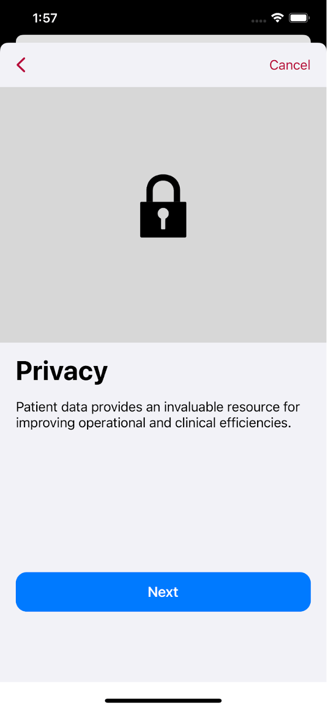
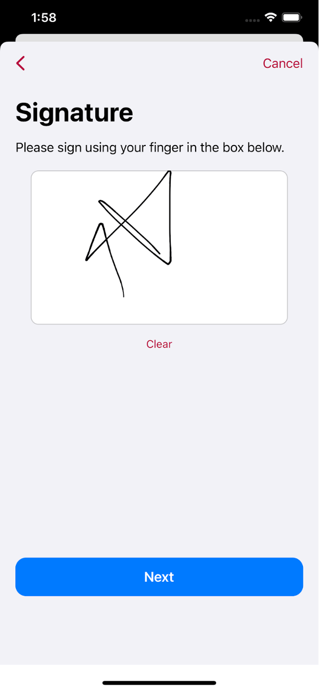
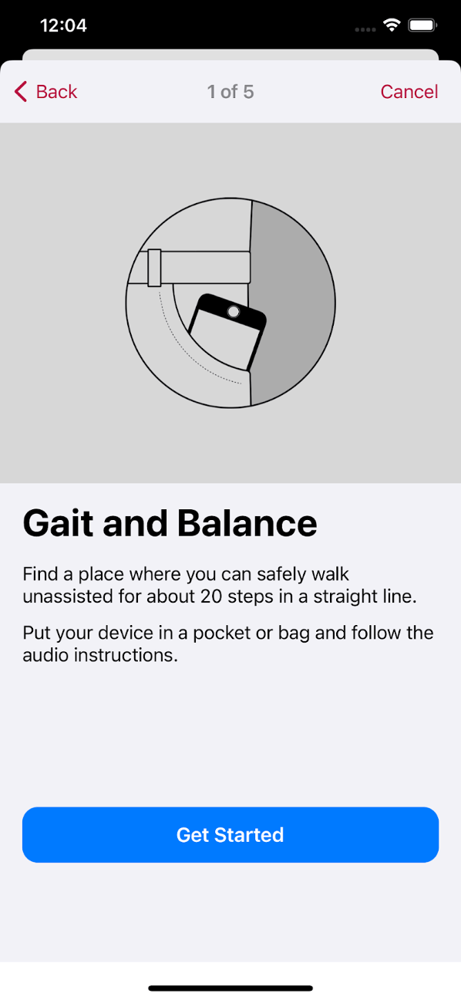
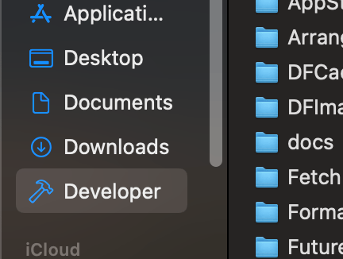
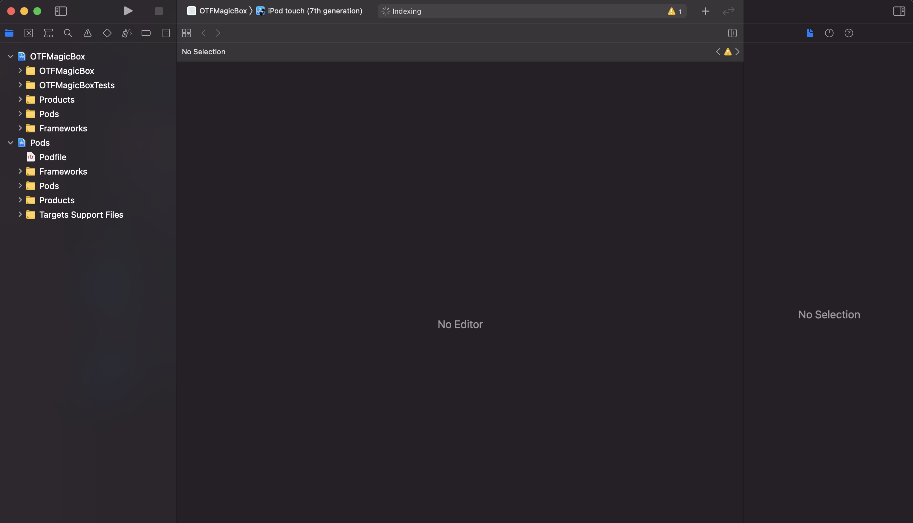

# TheraForge MagicBox 1.0.1-beta

The Open TheraForge (OTF) MagicBox app is a template for creating digital health solutions that help people better manage their health.

This sample application leverages TheraForge frameworks such as [OTFTemplateBox](../../../OTFTemplateBox) to implement a no-code solution that can be customized without requiring any code changes.

For more details on the features of the SDK and on the TheraForge Cloud setup process (e.g., to obtain an API key), refer to the [OTFToolBox](../../../OTFToolBox) Readme file.

## Change Log
* Release 1.0.0-beta: First beta release of the template app
* Release 1.0.1-beta: Removed warnings, improved profile section, added UI samples and made various other improvements

# Table of Contents

* [Overview](#Overview)
* [Features](#Features)
* [Installation](#Installation)
* [Usage](#Usage)
* [License](#License)

# Overview <a name="Overview"></a>

MagicBox app’s source code represents an example of how to use the frameworks in the TheraForge SDK. It will constantly evolve to incorporate and showcase new features of the SDK.

You can use MagicBox as a reference, or you can fork it and make it the starting point for your own app. This open template can help you to create your own digital health application prototype in just a few minutes, without investing a lot of time and money, and even with limited knowledge of coding.

These are its primary characteristics:

* No-code configuration and setup for accelerated development.
* Informed consent process and survey generation using Apple's ResearchKit framework.
* Care plan management using Apple's Carekit framework.
* Monitoring of health data with Apple's HealthKit framework.
* Automatic data synchronization across the Cloud (a la Dropbox) using the OTFToolBox SDK.
* Support for various popular technologies out of the box: user authentication (Sign in with Apple in addition to standard login) with OAuth2, HIPAA- abd GDPR-compliant traffic encryption at rest and in transit (uses TLS 1.3 crypto), app notifications using HTTP 2 Server-Sent Events (SSE), etc.
* SF Symbols 1.1 support (available on iOS/iPadOS 13 and watchOS 6, and later releases)


# MagicBox Features <a name="Features"></a>

MagicBox includes the following customizable features:

<p align="center"></p>

## Onboarding

When a user launches an app for the first time, the onboarding process presents the app’s goals and provides instructions that highlight key benefits and features.

<p align="center"></p>

## Consent

The informed consent is the process of a user granting authorization to an application to access specific resources on their behalf (for exammple, health sensors) and/or to perform certain actions (for example, as part of a medical study). Users will be asked for consent to allow access to their personal data.

<p align="center"></p>

## Consent Form and Signature

The consent form contains the description of the items included in the application that require explicit user consent. The user can agree to the clauses by signing the form.

<p align="center"></p>

<p align="center"></p>

## Simplified Registration and Login Process

The app includes screens to get a user to sign up to use a medical intervention, telemedicine account or research project. The registration page of the application asks for basic user details such as email, password, fullname, last name, date of birth and gender, etc. For example, date of birth can be used for a minimum age eligibility check to limit the use of the app.

<p align="center"></p>

## Login/Social Login

MagicBox supports different login strategies: regular login using registration details, Sign in with Apple and Sign in with Google.

User login credentials are securely stored in the device’s keychain.

<p align="center"></p>

## Passcode

In order to protect access, the app can optionally require a four- or six-digit user-selected passcode.

<p align="center"></p>

## Activity

There are a number of pre-defined task types that you can include in your project: for example, a two finger tap test, the 6 minute walk test, a special memory test and a short walk test to measure gait and balance. These tasks include the instructions for the steps to perform to complete them.

<p align="center"></p>

## Surveys

A survey is a sequence of questions that you use to collect data from the users. Each step addresses a specific question in the survey, such as “What medications are you taking?” or “How many hours did you sleep last night?”. You can collect results for the individual steps or for the task as a whole.

<p align="center"></p>

## Contacts

Contacts are cards that contain doctor and family member details, such as address, phone number, messaging number, email address, etc.

<p align="center"></p>

## User Profile

The profile section includes the user account view as well as additional information, actions and links such as help, report, customer support address, withdrawal from study, and logout.

<p align="center"></p>

## TheraForge Secure Cloud with Sync Support

MagicBox can be connected to the TheraForge Cloud service to implement offline-fist cloud synchronization.

For example, below we show the app's user profile on multiple devices before the date of birth is changed:

<p align="center"></p>

When the date of birth is changed to 12-16-2001 on the second device from the left:

<p align="center"></p>

And after the date of birth is automatically synchronized securely across the cloud to all devices:

<p align="center"></p>

For patient adherence tracking, a patient's glucose level is checked and recorded, then it’s automatically synchronized to multiple devices:

<p align="center"></p>

Glucose level check completed on the second device from the left:

<p align="center"></p>

Outcome is automatically synchronized securely across the cloud to all devices:

<p align="center"></p>

# MagicBox Installation <a name="Installation"></a>

The MagicBox app installation process requires the installation of the ToolBox SDK and so it is similar to the process described in the [OTFToolBox](../../../OTFToolBox) Readme file.

* [Prerequisites](#Prerequisites)
* [App Setup](#App-Setup)

## Prerequisites <a name="Prerequisites"></a>

An Intel-based Mac running [macOS Catalina 10.15.4 or later](https://developer.apple.com/documentation/xcode-release-notes/xcode-12-release-notes) or a Mac with Apple's M1 Silicon running [macOS 11 Big Sur](https://developer.apple.com/documentation/xcode-release-notes/xcode-12_2-release-notes). macOS 12 Monterey and Xcode 13 are supported.

### 1. Installation Prerequisites

In order to develop iOS apps, make sure to download Xcode, Apple's Integrated Development Environment (IDE), from the Mac App Store.

<p align="center"></p>

If you haven't done it yet, follow this [Xcode article](https://medium.nextlevelswift.com/install-and-configure-xcode-7ed0c5592219) to install and configure it.

(Note that in case of Xcode 13.2 Apple recommends to download it directly from the Apple Developer web site https://developer.apple.com/download/all/?q=Xcode. Some developers consider this installation method *preferable for all versions of Xcode*, that is, it’s considered a best practice. However, in this case you also need to install the *Command Line Tools for Xcode*, which are a separate download.)

<p align="center"></p>

After installing the Xcode app, you will also need to install the [CocoaPods](https://cocoapods.org/) dependency manager for Swift and Objective-C Cocoa projects.

If you are new to CocoaPods you can refer to the [CocoaPods Guides](https://guides.cocoapods.org/using/using-cocoapods.html) to learn more about it.

CocoaPods is built with the Ruby language and can be installed with the default version of Ruby available with macOS.

<p align="center"></p>

However, before installing CocoaPods, we recommend that you also install the [Homebrew](https://brew.sh/) package manager. Refer to our [Homebrew Installation](Docs/Homebrew.md) page for prerequisites and caveats.

To do that, open the Terminal application (you can type ⌘+spacebar to bring up the macOS Spotlight search, enter `Terminal` in it, and then press Return).

Then type the following command in Terminal:

```
/bin/bash -c "$(curl -fsSL https://raw.githubusercontent.com/Homebrew/install/HEAD/install.sh)"
```

as explained in the [Homebrew](https://brew.sh/) main page. (If you get an error, check out our [Homebrew Installation](Docs/Homebrew.md) page.)

Wait for the installation to end.


OTFToolBox by default includes Apple's ResearchKit framework. Building it requires the installation of the `git-lfs` tool like so:

```
brew install git-lfs
```

Finally, to install Cocoapods in Terminal enter:

```
sudo gem install cocoapods
```

as shown below:


Refer to our [Cocoapods Installation](Docs/Cocoapods.md) page for prerequisites, caveats and troubleshooting suggestions.

After successful installation of `git-lfs` and Cocoapods, you can install the MagicBox app.

## App Setup <a name="App-Setup"></a>

### 1. Create the Developer Directory and a Project Subdirectory 

You need to create a project directory in your user directory.

For example, in `Terminal` go to your personal directory by typing this command:

```
cd ~
```

In the Finder that corresponds to your home directory (the one with the home icon and your username).

The canonical way to store software development projects is by creating a ~/Developer sub-directory.
The Finder has a special "hammer" icon just for this sub-directory (that you can also add to the sidebar):



So go ahead and create a “Developer” directory (if you haven’t done it already) in the Finder or in Terminal like so:

```
mkdir ~/Developer
```

This directory will be used to add projects to it.

In the Terminal application change your directory to the `Developer` folder:

```
cd ~/Developer
```

### 2. Copy MagicBox's Repository URL

Next, copy the URL of MagicBox's repository in GitHub to clone it. Remember to select HTTPS from the options (as highlighted in red in the image) and copy the repository URL (by clicking on the double square icon highlighted in red):


This is the URL that you should get from GitHub:

`https://github.com/TheraForge/OTFMagicBox.git`

### 3. Clone MagicBox's Repository to Install the App

Then go back to the Terminal app in the `Developer` directory and enter `git clone` followed by the repository URL you just copied in the previous step:


Then change the directory to the newly-created OTFMagicBox subdirectory:

`cd OTFMagicBox`

### 4. List the Cloned Files

Run the `ls` command in Terminal to see the files in the directory cloned from the GitHub repository.


Note the file called `Podfile` in the list.

### 5. Installation of the ToolBox SDK

Run the `pod install` command to install the SDK and its dependencies. After you run this command, you should see something similar to what is shown in the image below:


### 6. List the Files Again

Now list the files again using `ls` command in Terminal. This time you'll see two extra files in the list as highlighted in the image:


### 7. Open the Project Workspace

`OTFMagicBox.xcworkspace` is the Xcode workspace file you should use from now onwards.
To open this workspace file in Xcode, you may either double click it in the Finder or open it using the `open OTFMagicBox.xcworkspace` command in Terminal:


You can also launch Xcode first and open this file from the startup screen:


When this project opens in Xcode you should see something like this:



### 8. Compile & Run

Type `Cmd + B` or click on the **Product** -> **Build** menu item to build the project.

You may want to select a specific iPhone model from the dropdown menu before building.

Make sure that it's compiling without any errors.

Then you are ready to rock!

If you now wish to customize the app, refer to the sections below for detailed information.

# App Usage <a name="Usage"></a>

After following the above installation steps, go to the `AppSysParameters.yml` file in the root folder of your project.
This yaml file contains the list of customizable parameters of your health application.
You don’t need to be a developer to edit this file and customize the application, just use a common editor (e.g., TextEdit or Xcode) and follow the simple instructions present in the `AppSysParameters.yml` file.
By editing this yaml file you can customize the health application according to your requirements, for example you can modify the app styling and flow.

Review the complete yaml file to learn about the available settings (also called *key-value pairs*) and edit the values of the keys according to your application's requirements, which will allow you to customize your digital health application in just a few minutes.

## Change the App's Name

You can modify the app's name by following the instructions given below.

Go to the root of your project in Xcode (sidebar shown in the figure below).


Click on the `Info.plist` file. Xcode will show the contents of the `Info.plist` file as a list of settings (key-value pairs). Go to the row with the key named “Bundle name”. Click on the Value column of that row and change the value to your application name, as shown in the figure below.

Example: change $(PRODUCT_NAME) to “My Digital App”.  


## Modify the Style/Design

You can change the tint color, the label colors, font type and size to customize the look of your application:

[Color Codes in designConfig Section](/OTFMagicBox/AppSysParameters.yml#L83-L177)

## Set up the TheraForge Cloud API Key

Update the API key field to access the TheraForge Secure Cloud service for synchronization and communication with the web dashboards:

[API Key Configuration Section](/OTFMagicBox/AppSysParameters.yml#L194-L195)

## Customize Onboarding

To customize the onboarding process, go to the onboarding section in the `AppSysParameters.yml` file and add as many onboarding pages as you need. You can add the image types of your choice such as Emoji, SF Symbols and assets. In the description you can write the text explaining each particular onboarding page:

[Onbarding Configuration Section](/OTFMagicBox/AppSysParameters.yml#L220-L228)

## Customize Consent

To customize the Consent process of your application go to the Consent section in the `AppSysParameters.yml` file and add/modify the required sections. Follow the instructions given in the yaml file to add the correct type of consent sections:

[Consent Configuration Section](/OTFMagicBox/AppSysParameters.yml#L230-L286)

## Customize Registration and Login

Go to the Registration section in the `AppSysParameters.yml` file and change the settings for *Date Of Birth* and *Gender* to `true` if you want to display those fields in your Registration form, otherwise set them to `false`:

[Registration Configuration Section](/OTFMagicBox/AppSysParameters.yml#L288-L293)

## Configure Regular Login/Social Login

Go to the Login section in the `AppSysParameters.yml` file and customize the title and the description.

If you want to use the *Sign up With Apple* feature, then change the corresponding setting to `true`:

[Login Configuration Section](/OTFMagicBox/AppSysParameters.yml#L295-L306)

## Configure the Passcode

Go to the Passcode section in the `AppSysParameters.yml` file and change the settings of passcode text and passcode type to 4 or 6 digits:

[Passcode Configuration Section](/OTFMagicBox/AppSysParameters.yml#L308-L316)


## Enable CareKit

If your application requires support for tasks (for example, for a care plan) and contacts, then enable the `useCareKit` key, which allows you to display the contacts and list the tasks of the patients:

[Carekit Configuration Section](/OTFMagicBox/AppSysParameters.yml#L327-L330)


# License <a name="License"></a>

This project is made available under the terms of a modified BSD license. See the [LICENSE](LICENSE.md) file.
