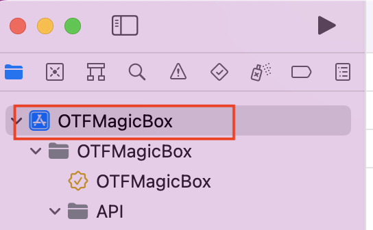
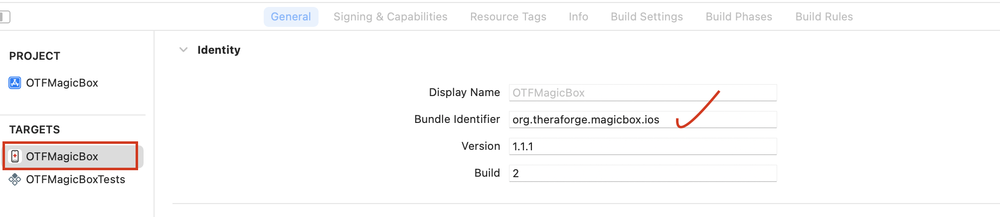
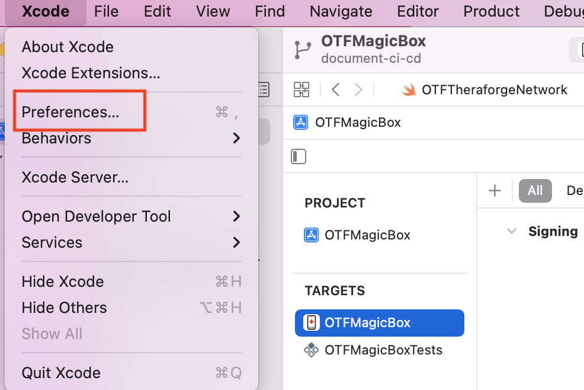
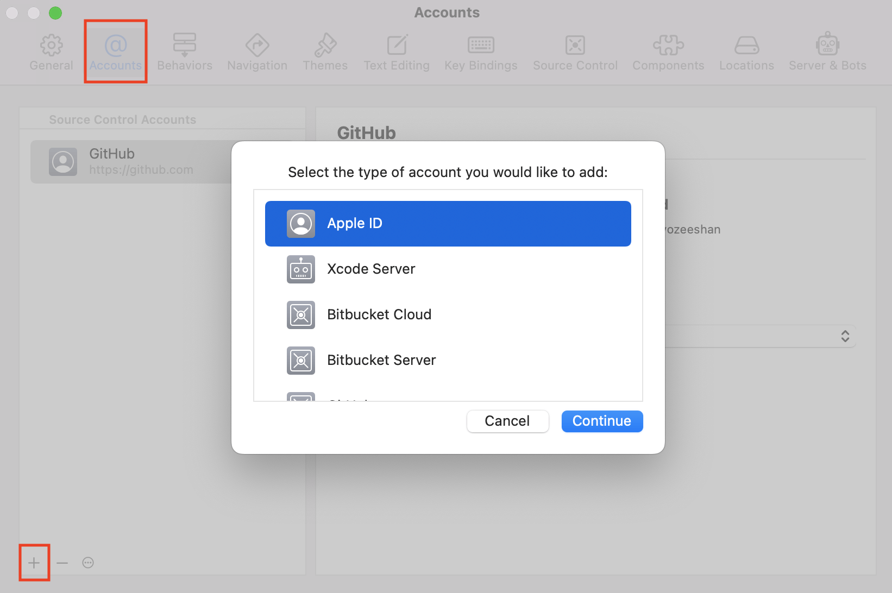
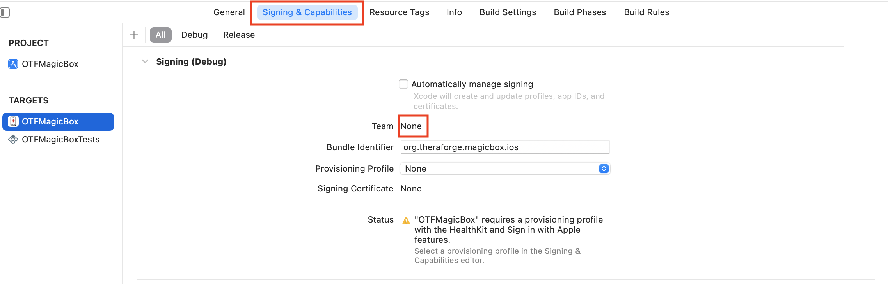
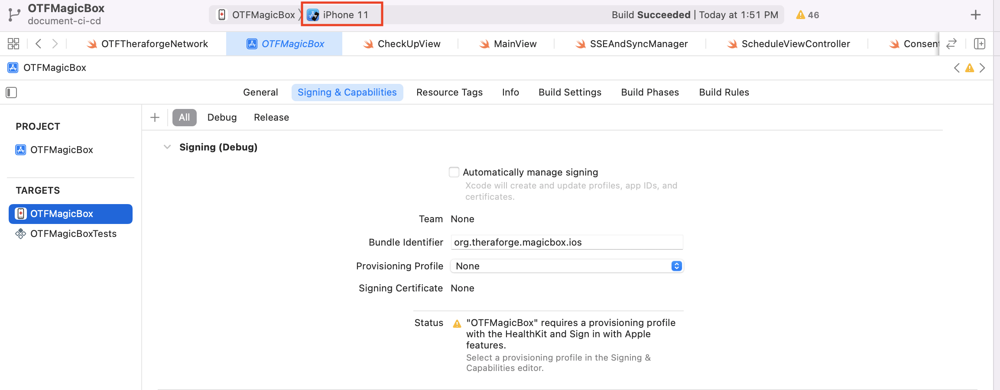

# Xcode Setup

In Xcode select the project's workspace in the sidebar, as shown in the figure below.

In the *General* section, in the *Targets* list as shown below, select the OTFMagicBox target and replace the placeholder bundle identifier with your own, which you registered in your Apple developer account.

## Apple ID Login

Select *Xcode* from the top bar and navigate to *Preferences* in the dropdown menu.

A dialog box appears, navigate to the *Accounts* tab, click on the *plus* button, select *Apple ID* and press continue as shown in the figure below.

Enter the username and password of your developer account to log in.

After login, jump to *Signing & Capabilities* and enter your *team* and *provisioning profile* information.

Connect your mobile device to your Mac computer.

Select your device's name from the dropdown menu, and then you can run the application on the physical device.

